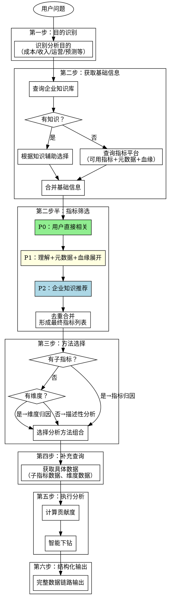
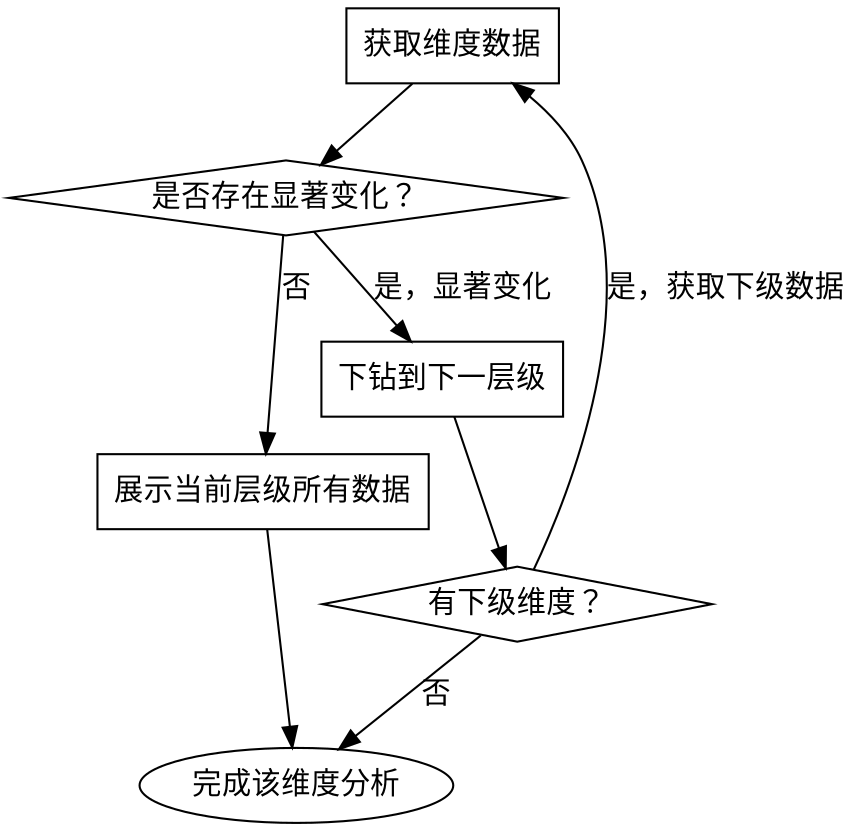

# 智能数据分析

**版本：0.0.5**

## TRIGGER when

- 用户说/问"帮我分析 XXX"
- 用户说/问"看看 XXX 增加的原因"
- 用户说/问"为什么 XXX 变化了"
- 用户说/问"XXX 的影响因素是什么"
- 需要对指标进行归因、拆解、对比分析

## DO NOT TRIGGER when

- 用户上传了 Excel/CSV 等表格文件要求分析 → 用 table-data-analysis

## Overview

**核心原则**：目的识别 → 获取基础信息（含企业知识）→ 指标筛选 → 方法选择 → 补充查询 → 执行分析 → 结构化输出

这个 skill 帮助你在智能问数平台上：
1. 识别用户分析目的（不只是"要分析"，而是"为了什么"）
2. **优先查询企业知识库**，有则参考，无则模型自主判断
3. **先获取基础信息**（指标元数据、血缘、维度），再决定用什么指标、选什么方法
4. **筛选相关指标**，排除无关指标（如因果链过远的指标）
5. 基于已知信息选择正确的分析方法
6. 执行系统性分析（含智能下钻，可能需要多次交互）
7. 输出结构化结果（完整数据链路）

## 完整分析流程



---

## 第一步：分析目的识别

用户问题背后通常有以下目的之一：

| 目的类型 | 关键词 | 示例 |
|---------|-------|------|
| 成本分析 | 成本、费用、支出 | "分析人力成本增加原因" |
| 收入分析 | 收入、营收、销售额 | "看看收入下降原因" |
| 活动运营 | 活动、运营、效果 | "分析这次活动效果" |
| 效率分析 | 效率、转化、漏斗 | "分析转化率下降原因" |
| 预测分析 | 预测、趋势、未来 | "预测下季度走势" |
| 异动分析 | 异常、波动、突增突降 | "为什么突然上涨" |

---

## 第二步：获取基础信息

**关键**：在决定分析方法之前，必须先了解指标的基础信息。

### 2.1 查询企业知识（优先）

**目的**：检查是否有历史分析经验或企业知识可以借鉴

| 查询内容 | 用途 |
|---------|------|
| 类似分析案例 | 了解之前是怎么分析的，用了哪些指标 |
| 指标推荐规则 | 企业定义的指标关联规则 |
| 业务知识 | 行业/公司特有的指标关系 |

**查询示例**：
```
用户问题："帮我分析充电站人力成本"

查询企业知识库：
→ 是否有"人力成本分析"相关案例？
→ 是否有"充电站成本"相关指标推荐？
→ 返回：相关案例、推荐指标列表
```

### 2.2 查询指标平台

| 信息 | 查询内容 | 用途 |
|-----|---------|------|
| 可用指标列表 | 平台支持哪些指标 | 知道有什么可用 |
| 指标元数据 | 指标定义、口径、单位 | 理解指标含义 |
| 指标血缘/计算公式 | 该指标由哪些子指标构成 | 决定是否用指标归因 |
| 可用维度列表 | 该指标支持哪些维度 | 决定是否用维度归因 |

### 2.3 信息来源优先级

| 优先级 | 来源 | 说明 |
|-------|------|------|
| 1 | 企业知识库 | 有历史经验优先参考 |
| 2 | 模型判断 | **无知识时，先查询指标平台（元数据、血缘、维度），再判断** |

**重要**：无论是参考企业知识还是模型自主判断，都必须先获取基础信息（指标元数据、血缘、维度），再决定用什么指标、选什么方法。

---

## 第二步半：指标筛选

**目的**：从平台可查询的所有指标中，筛选出与分析目的相关的指标

### 筛选优先级

| 优先级 | 条件 | 说明 | 示例 |
|-------|------|------|------|
| **P0** | 用户直接相关 | 用户问题中明确提及的指标 | "分析租金" → 租金 |
| **P1** | 理解+元数据+血缘 | 根据分析目的理解，结合元数据和血缘关系展开 | 成本分析 → 成本构成项、订单量 |
| **P2** | 企业知识推荐 | 企业知识库推荐的相关指标 | 历史案例推荐指标 |

### P0：用户直接相关

**判断标准**：用户问题中明确提及的指标，直接纳入

| 用户问题 | P0 指标 |
|---------|--------|
| "分析租金和电费加成的变化" | 租金、电费加成 |
| "看看成本增加会在什么地方" | 人力成本（核心指标） |

### P1：理解+元数据+血缘展开

**判断标准**：根据分析目的，结合指标元数据和血缘关系，找出间接相关但有逻辑关系的指标

| 分析目的 | P0 指标 | P1 展开（为什么） |
|---------|--------|------------------|
| 成本分析 | 人力成本 | 子指标（血缘）→ 值守/运维/销售人力成本 |
| 成本分析 | 租金、电费加成 | 订单量（元数据：影响单位成本）、电损（血缘：电费加成构成） |
| 盈利分析 | 收入、成本 | 毛利（计算关系）、订单量（因果关系） |

### P2：企业知识推荐

**判断标准**：企业知识库中历史分析案例推荐的指标

| 场景 | 企业知识推荐 |
|-----|-------------|
| 充电站成本分析 | 推荐指标：充电订单量、充电电量、电损率 |
| 人力成本分析 | 推荐指标：人员编制、人均成本、人效 |

### 排除规则

| 规则 | 说明 | 示例 |
|-----|------|------|
| **因果链过远** | 与分析目标关系间接 | 成本分析 → 商城GMV |
| **不同业务域** | 属于其他业务线 | 充电业务 → 会员积分 |
| **数据无关联** | 维度不匹配或无逻辑关系 | 充电站成本 → 公司股价 |

### 筛选流程

```
1. 提取 P0 指标（用户直接相关）
     ↓
2. 查询企业知识库（是否有推荐指标）
     ↓
3. P1 展开（理解+元数据+血缘）
     ↓
4. 去重合并，形成最终指标列表
     ↓
5. 获取各指标的数据
```

### 指标筛选示例

**用户问题**："帮我分析充电租金和商务条件里的电费加成的变化，我要看看各站点变化程度以及对经营的影响"

**步骤1：提取 P0 指标**
- 租金 ✅
- 电费加成 ✅

**步骤2：查询企业知识库**
- 有充电站成本分析案例 → 推荐指标：充电订单量、充电电量
- 无"经营影响"相关案例

**步骤3：P1 展开**
- 电费加成 → 查血缘 → 包含充电电损 ✅
- 经营影响 → 理解 → 需要订单量（计算收入）✅

**步骤4：最终指标列表**

| 指标 | 来源 | 优先级 |
|-----|------|-------|
| 租金 | P0（用户提及） | 必须 |
| 电费加成 | P0（用户提及） | 必须 |
| 充电电损 | P1（血缘展开） | 必须 |
| 充电订单量 | P1+P2（理解+企业知识） | 必须 |
| 商城GMV | - | ❌ 排除（因果链过远） |

---

## 第三步：方法选择

**基于已知信息选择方法**，而非凭空猜测。

### 方法选择决策表

| 基础信息 | 选择的方法 | 说明 |
|---------|-----------|------|
| 有子指标（血缘/计算公式） | **指标归因** | 拆解子指标贡献 |
| 有维度 | **维度归因** | 看各维度贡献 |
| 有时序数据需求 | **趋势对比** | 同比/环比分析 |
| 多因素影响 | **贡献计算** | 计算各因素贡献度 |
| 留存相关 | **Cohort分析** | 队列分析 |
| 需要评估因果 | **因果推断** | DID/PSM/RDD |

### 方法说明

| 方法 | 适用场景 | 需要获取的信息 |
|-----|---------|---------------|
| **指标归因** | 指标由多个子指标构成，需拆解 | 各子指标数据 |
| **维度归因** | 看哪个维度贡献大 | 各维度下的指标数据 |
| **贡献计算** | 计算各因素贡献度 | 子指标/维度的时序数据 |
| **趋势对比** | 同比/环比分析 | 时间序列数据 |
| **Cohort分析** | 留存、队列分析 | 按时间分组的用户数据 |
| **因果推断** | 无法A/B测试时评估影响 | 对照组/实验组数据 |

---

## 第四步：补充查询

确定方法后，列出需要补充获取的信息：

### 根据方法获取

| 方法 | 需要补充查询 |
|-----|-------------|
| 指标归因 | 各子指标的时间序列数据（本期、上期） |
| 维度归因 | 各维度下的指标数据 |
| 贡献分析 | Top N 维度数据 |
| 因果推断 | 对照组/实验组数据 |

---

## 第五步：执行分析

**重要**：分析过程可能需要多次与模型交互，进行迭代式查询和下钻。

### 1. 执行基础分析
- 按选定的方法进行分析
- 计算贡献度
- 识别关键因素

### 2. 智能下钻

**原则**：自动定位到问题最突出的粒度，而非停留在粗粒度



**下钻规则**：
| 场景 | 动作 |
|-----|------|
| 某区域变化超过整体平均变化的 1.5 倍 | 自动下钻该区域下的城市数据 |
| 某城市变化显著 | 可继续下钻到站点/门店级别 |
| 多个层级都有显著变化 | 逐层展示，形成完整下钻链路 |

**交互说明**：
- 每次下钻可能需要向模型发起新的数据查询
- 分析过程是迭代的：查数据 → 分析 → 发现问题 → 下钻 → 再查数据
- 保留完整的分析日志，便于问题排查

### 3. 综合判断
- 结合多个分析结果
- 形成结论

---

## 第六步：结构化输出

**输出原则**：展示完整的数据→结论链路，让用户清楚看到分析过程

```markdown
## 基础数据

### 整体指标概览
[核心指标的时间对比数据：本期、上期、变化]

### 子指标数据
[指标归因相关的各子指标数据，包含对整体的影响]

### 维度数据
[各维度层级的完整数据，包含智能下钻发现的细粒度数据]

---

## 分析方法

本次分析采用以下方法：
- **[方法1]**：[选择原因，基于哪些基础信息]
- **[方法2]**：[选择原因]
- ...

---

## 详细分析结果

### [分析维度1，如：成本项分析]
[详细分析内容 + 具体发现 + 建议]

### [分析维度2，如：区域维度分析]
[详细分析内容 + 具体发现 + 建议]

### [智能下钻发现]
[下钻过程中发现的关键问题，如：华南区下某城市异常]

---

## 综合结论与建议

### 核心结论
[1-3 句话总结核心发现]

### 运营建议（按优先级）

| 优先级 | 建议措施 | 预期效果 | 责任方 |
|-------|---------|---------|-------|
| 高 | ... | ... | ... |
| 中 | ... | ... | ... |

### 下一步行动
[具体的可执行步骤]
```

---

## 常见错误

| 错误 | 正确做法 |
|-----|---------|
| **跳过企业知识查询** | 优先查询企业知识库，有则参考，无则模型判断 |
| **指标筛选不当** | 按P0→P1→P2优先级筛选，排除因果链过远的指标 |
| **跳过基础信息查询** | 必须先查询指标元数据、血缘、维度，再选方法 |
| **目的识别错误** | 不只识别"要分析"，要识别"为了什么目的" |
| **方法选择错误** | 只做描述性分析，不给原因 → 必须做归因分析 |
| **信息需求遗漏** | 不获取维度数据就下结论 → 先获取维度数据再分析 |
| **粒度不够细** | 只看区域不下钻 → 自动下钻到问题最突出的粒度 |
| **分析执行不规范** | 直接给结果，没有系统性拆解 → 按流程执行 |
| **结果呈现不足** | 建议太泛（"关注趋势"）→ 给出具体可操作建议 |
| **不说明方法** | 直接给结论 → 明确说明使用了什么分析方法，基于什么信息选择 |
| **数据链路不清晰** | 只给结论不给数据 → 展示完整的基础数据和分析过程 |

## Red Flags - 停下来检查

当你有以下想法时，停下来重新审视：

- "我知道用什么方法了" → 先查询基础信息，再决定方法
- "这个指标可能有用，先加上" → 按P0→P1→P2筛选，排除无关指标
- "直接给用户数据就行" → 需要分析原因，不只是展示数据
- "这个指标没有子指标" → 检查指标血缘，可能漏了
- "维度太多，不用都看" → 至少看 Top N，不能跳过
- "用户没问那么细" → 归因分析需要系统性，自动下钻到最细
- "建议写'持续关注'就行" → 必须给出可操作的具体建议
- "只看区域就够了" → 检查是否需要下钻到城市/站点

## 统计陷阱警示

### 数据泄露陷阱
**问题**：用未来数据预测过去，或训练数据包含目标信息
**检查**：
- 时间序列分析时，确保只用历史数据预测未来
- 不要用"事后"数据解释"事前"变化

### 辛普森悖论
**问题**：分组看趋势和整体看趋势相反
**检查**：
- 同时看整体趋势和分组趋势
- 如果方向相反，必须说明并分析原因

### 幸存者偏差
**问题**：只分析"存活"的样本，忽略"消失"的
**检查**：
- 问自己：是否有样本被排除了？
- 流失用户、关闭门店等是否在数据中？

### 基数效应
**问题**：小基数波动大，大基数波动小
**检查**：
- 看绝对变化量，不只是百分比
- 小维度的高增长率可能是噪音

### 相关性≠因果性
**问题**：两个指标同时变化，误认为有因果关系
**检查**：
- 是否有第三个因素同时影响两者？
- 是否有时间先后关系？

### 选择偏差
**问题**：样本不是随机的，结论不能推广
**检查**：
- 分析的群体是否能代表整体？
- 自选择（如只分析活跃用户）是否影响结论？

---

## 版本历史

| 版本 | 日期 | 变更说明 |
|-----|------|---------|
| 0.0.1 | 2026-03-27 | 初始版本 |
| 0.0.2 | 2026-03-27 | 新增：智能下钻逻辑、多次交互说明、完整数据链路输出结构 |
| 0.0.3 | 2026-03-27 | **流程重构**：目的识别→获取基础信息→方法选择→补充查询→执行分析→输出。方法选择必须基于已知的基础信息。 |
| 0.0.4 | 2026-03-30 | **新增指标筛选环节**：①优先查询企业知识库辅助选择指标 ②新增P0/P1/P2指标筛选优先级 ③明确排除规则（因果链过远、不同业务域） |
| 0.0.5 | 2026-04-02 | **优化触发条件**：①description改为中文 ②新增TRIGGER when明确触发场景 ③新增DO NOT TRIGGER when区分table-data-analysis场景 ④合并原When to Use内容 |
