# 表格数据分析

**版本：0.0.2**

## Overview

**核心原则**：理解问题 → 探索数据 → 处理数据 → 执行分析 → 结构化输出

这个 skill 帮助你分析用户上传的表格数据：
1. **理解用户意图**：明确型（具体指令）和模糊型（探索性分析）两种场景
2. **查询企业知识**：优先查询企业知识库，获取分析方法或处理逻辑
3. **自主探索数据**：同时查看数据结构和列名，推断分析方向
4. **灵活处理数据**：只要模型支持的处理都可执行，服务于用户意图
5. **全面分析**：即使用户表达明确，也补充其他有价值的分析
6. **透明输出**：说明做了什么、为什么没做某些处理

## 完整分析流程

```dot
digraph table_analysis_flow {
    rankdir=TB;

    start [label="用户上传表格+问题" shape=ellipse];

    subgraph cluster_0 {
        label="第一步：理解问题";
        check_intent [label="判断用户意图类型" shape=diamond];
        explicit [label="明确型\n（具体指令）" shape=box];
        vague [label="模糊型\n（探索性分析）" shape=box];
        merge_intent [label="整合意图\n（明确+补充）" shape=box];
    }

    subgraph cluster_1 {
        label="第二步：查询企业知识";
        check_knowledge [label="查询企业知识库" shape=box];
        has_knowledge [label="有相关知识？" shape=diamond];
        use_knowledge [label="参考企业知识\n（分析方法、处理逻辑）" shape=box];
        no_knowledge [label="模型自主判断" shape=box];
        merge_knowledge [label="整合知识" shape=box];
    }

    subgraph cluster_2 {
        label="第三步：探索数据";
        explore_structure [label="探索数据结构\n（行数、列数、类型）" shape=box];
        explore_columns [label="分析列名含义\n（推断业务含义）" shape=box];
        explore_stats [label="基础统计分析\n（分布、缺失、异常）" shape=box];
        merge_explore [label="综合判断\n数据特征" shape=box];
    }

    subgraph cluster_3 {
        label="第四步：处理数据";
        check_confirm [label="工程是否支持追问？" shape=diamond];
        confirm [label="确认分析方向\n（向用户确认）" shape=box];
        direct_process [label="直接处理" shape=box];
        process_data [label="数据处理\n（清洗、转换、计算）" shape=box];
    }

    subgraph cluster_4 {
        label="第五步：执行分析";
        select_methods [label="选择分析方法\n（主分析+补充分析）" shape=box];
        execute [label="执行分析" shape=box];
    }

    subgraph cluster_5 {
        label="第六步：结构化输出";
        output [label="输出结果\n（做了什么、没做什么、原因）" shape=box];
    }

    start -> check_intent;
    check_intent -> explicit [label="具体指令"];
    check_intent -> vague [label="探索性"];
    explicit -> merge_intent;
    vague -> merge_intent;

    merge_intent -> check_knowledge;
    check_knowledge -> has_knowledge;
    has_knowledge -> use_knowledge [label="是"];
    has_knowledge -> no_knowledge [label="否"];
    use_knowledge -> merge_knowledge;
    no_knowledge -> merge_knowledge;

    merge_knowledge -> explore_structure;
    explore_structure -> explore_columns;
    explore_columns -> explore_stats;
    explore_stats -> merge_explore;

    merge_explore -> check_confirm;
    check_confirm -> confirm [label="支持追问"];
    check_confirm -> direct_process [label="不支持"];
    confirm -> process_data;
    direct_process -> process_data;

    process_data -> select_methods;
    select_methods -> execute;
    execute -> output;
}
```



## When to Use

- 用户上传 Excel/CSV 文件并问"帮我分析这个数据"
- 用户问"看看这个表格有什么问题"
- 用户问"帮我算一下X列的均值/汇总"
- 用户问"把Y列按Z分组统计"
- 需要对表格数据进行探索、清洗、分析

---

## 第一步：理解问题

### 用户意图类型

| 类型 | 特点 | 示例 |
|-----|------|------|
| **明确型** | 用户给出具体指令 | "帮我算销售额的均值"、"把数据按地区分组汇总" |
| **模糊型** | 用户只说目的，需模型探索 | "帮我分析下这个数据"、"看看有什么规律" |

### 重要原则

**即使用户表达明确，也应补充其他有价值的分析**

| 场景 | 用户意图 | 补充分析 |
|-----|---------|---------|
| 用户要求计算均值 | 计算某列均值 | 同时展示分布、异常值、分组差异 |
| 用户要求分组汇总 | 按某列分组 | 同时展示组间差异显著性、占比分析 |
| 用户要求筛选数据 | 筛选特定条件 | 同时展示筛选前后对比、筛选结果分布 |

---

## 第二步：查询企业知识

**目的**：查询企业知识库，获取相关的分析方法或处理逻辑

### 查询内容

| 查询项 | 说明 | 示例 |
|-------|------|------|
| 分析方法 | 类似场景的分析方法 | "销售数据分析" → 推荐趋势分析、同期对比 |
| 处理逻辑 | 数据处理的标准流程 | "缺失值处理" → 推荐填充策略 |
| 业务规则 | 业务相关的计算规则 | "毛利率计算" → 公式：(收入-成本)/收入 |
| 数据字典 | 字段含义的解释 | "订单状态" → 各状态值含义 |

### 知识来源优先级

| 优先级 | 来源 | 说明 |
|-------|------|------|
| 1 | 企业知识库 | 有历史经验优先参考 |
| 2 | 模型判断 | 无知识时，模型自主判断 |

### 查询示例

```
用户上传：销售数据表格
用户问题："帮我分析下销售情况"

查询企业知识库：
→ 是否有"销售数据分析"相关案例？
→ 是否有相关字段的业务定义？
→ 返回：推荐分析方法、字段含义、计算规则

如果无相关知识：
→ 模型自主探索数据，推断分析方向
```

---

## 第三步：探索数据

**并行进行，综合判断**

### 3.1 探索数据结构

| 信息 | 查询内容 | 用途 |
|-----|---------|------|
| 行数、列数 | 数据规模 | 判断数据量级 |
| 数据类型 | 每列的类型（数值、文本、日期） | 推断分析方法 |
| 样本数据 | 前几行数据 | 理解数据内容 |

### 3.2 分析列名含义

| 信息 | 查询内容 | 用途 |
|-----|---------|------|
| 列名 | 字段名称 | 推断业务含义 |
| 命名规律 | 是否有前缀/后缀 | 推断数据结构 |
| 关联性 | 列名之间的关联 | 推断可能的分析维度 |

### 3.3 基础统计分析

| 信息 | 查询内容 | 用途 |
|-----|---------|------|
| 数值列统计 | 均值、中位数、最大最小、标准差 | 了解数据分布 |
| 缺失值 | 每列缺失比例 | 判断数据质量 |
| 异常值 | 是否有极端值 | 判断是否需要处理 |
| 唯一值 | 分类列的唯一值数量 | 判断是否适合分组 |

### 综合判断

结合用户意图 + 数据特征，确定分析方向：

```
用户意图（明确/模糊）
    +
数据结构（列类型、规模）
    +
列名含义（业务推断）
    +
数据分布（统计特征）
    ↓
确定分析方向
```

---

## 第四步：处理数据

### 4.1 确认环节（可选）

**条件**：如果工程支持追问

| 场景 | 动作 |
|-----|------|
| 模糊型 + 工程支持追问 | 向用户确认分析方向 |
| 模糊型 + 工程不支持追问 | 直接执行，输出中说明判断依据 |
| 明确型 | 按用户意图执行，补充其他分析 |

### 4.2 数据处理范围

**原则**：只要模型支持的处理都可执行，服务于用户意图和分析意图

| 处理类型 | 说明 | 示例 |
|---------|------|------|
| **数据清洗** | 处理缺失值、异常值、重复值 | 填充缺失值、删除异常行 |
| **数据转换** | 格式转换、单位转换 | 日期格式化、金额单位转换 |
| **数据计算** | 计算新列、汇总统计 | 计算增长率、分组汇总 |
| **数据筛选** | 按条件筛选 | 筛选特定时间段、地区 |
| **数据合并** | 合并多个表格（如有） | 关联多个sheet |

### 4.3 无法处理的情况

**当无法执行某些处理时，在输出中说明**：

| 情况 | 处理方式 |
|-----|---------|
| 用户要求但无法做到 | 说明原因，提供替代方案 |
| 模型预计需要但无法处理 | 说明为什么需要、为什么无法处理 |
| 数据质量问题导致无法处理 | 说明问题所在、建议解决方案 |

---

## 第五步：执行分析

### 5.1 分析方法选择

| 数据特征 | 选择的方法 | 说明 |
|---------|-----------|------|
| 数值型数据 | **描述性统计** | 均值、中位数、分布 |
| 分类数据 | **频次分析** | 各类别数量、占比 |
| 时间序列 | **趋势分析** | 时间趋势、周期性 |
| 多列关联 | **相关性分析** | 列之间的关系 |
| 分组数据 | **对比分析** | 组间差异 |
| 用户明确要求 | **主分析** | 按用户意图执行 |
| 补充价值 | **补充分析** | 额外有价值的分析 |

### 5.2 分析执行

- 按选定的方法执行主分析
- 补充其他有价值的分析
- 计算关键指标
- 识别关键发现

---

## 第六步：结构化输出

**输出原则**：展示完整的数据→处理→分析→结论链路，让用户清楚看到分析过程

```markdown
## 数据概况

### 数据基本信息
[行数、列数、数据类型、时间范围等基本信息]

### 数据质量
[缺失值情况、异常值情况、重复值情况]

### 列信息
[各列的含义推断、数据类型、统计概要]

---

## 分析说明

### 用户意图
[用户想要分析什么：明确要求 + 模糊目的]

### 分析方法
本次分析采用以下方法：
- **主分析**：[用户明确要求的分析] - [选择原因]
- **补充分析**：[额外补充的分析] - [补充原因]

### 处理说明
- **已处理**：[做了哪些数据处理，如：删除了X行缺失值、转换了Y列格式]
- **未处理**：[没做哪些处理及原因，如：无法处理Z列因为...]

### 企业知识参考（如有）
- 参考了企业知识库中的 [知识点名称]
- 应用了 [分析方法/处理逻辑]

---

## 分析结果

### [主分析结果]
[用户明确要求的核心分析结果]
[具体数据 + 图表（如适用） + 发现]

### [补充分析结果1]
[额外补充的分析结果]
[具体数据 + 发现]

### [补充分析结果2]
[额外补充的分析结果]
[具体数据 + 发现]

---

## 关键发现

[从数据中发现的主要洞察，3-5点]

1. [发现1]
2. [发现2]
3. [发现3]

---

## 建议

### 可执行建议（按优先级）

| 优先级 | 建议措施 | 预期效果 |
|-------|---------|---------|
| 高 | ... | ... |
| 中 | ... | ... |
| 低 | ... | ... |

### 数据质量改进建议（如有）
[针对数据质量问题的改进建议]

### 下一步分析建议
[可以进一步分析的方向]
```

### 输出示例

**场景**：用户上传销售数据表格，问"帮我分析下销售情况"

```markdown
## 数据概况

### 数据基本信息
- 数据规模：1000 行 × 8 列
- 时间范围：2025年1月 - 2025年12月
- 数据类型：数值列 5 个，文本列 2 个，日期列 1 个

### 数据质量
- 缺失值：共 23 个（占比 0.29%），主要集中在 `客户评分` 列
- 异常值：`销售额` 列有 5 个极端值（>3倍标准差）
- 重复值：无

### 列信息

| 列名 | 推断含义 | 数据类型 | 非空率 |
|-----|---------|---------|-------|
| 订单ID | 订单唯一标识 | 文本 | 100% |
| 日期 | 订单日期 | 日期 | 100% |
| 地区 | 销售区域 | 文本 | 100% |
| 销售额 | 订单金额 | 数值 | 100% |
| 销量 | 销售数量 | 数值 | 100% |
| 单价 | 商品单价 | 数值 | 100% |
| 客户评分 | 客户满意度 | 数值 | 97.7% |
| 销售员 | 负责销售 | 文本 | 100% |

---

## 分析说明

### 用户意图
- **模糊目的**：了解销售整体情况
- **推断方向**：销售趋势、地区分布、销售员表现

### 分析方法
本次分析采用以下方法：
- **描述性统计**：了解销售额、销量的整体分布 - 基础分析
- **趋势分析**：按月分析销售趋势变化 - 时间维度
- **维度分析**：按地区、销售员分析销售分布 - 补充分析
- **异常检测**：识别异常订单 - 数据质量检查

### 处理说明
- **已处理**：
  - 转换 `日期` 列为日期格式
  - 计算新增列 `客单价` = 销售额 / 销量
- **未处理**：
  - `客户评分` 列的 23 个缺失值未填充（占比很小，不影响主分析）

---

## 分析结果

### 整体销售概况

| 指标 | 数值 |
|-----|------|
| 总销售额 | ¥12,580,000 |
| 总订单数 | 1,000 单 |
| 平均客单价 | ¥12,580 |
| 平均客户评分 | 4.2 分 |

### 月度销售趋势

| 月份 | 销售额 | 环比变化 | 订单数 |
|-----|-------|---------|-------|
| 1月 | ¥980,000 | - | 78 |
| 2月 | ¥850,000 | -13.3% | 68 |
| ... | ... | ... | ... |
| 12月 | ¥1,320,000 | +8.2% | 105 |

**发现**：下半年销售额明显高于上半年，12月达到峰值

### 地区销售分布

| 地区 | 销售额 | 占比 | 订单数 |
|-----|-------|------|-------|
| 华东 | ¥4,528,800 | 36.0% | 360 |
| 华南 | ¥3,144,200 | 25.0% | 250 |
| 华北 | ¥2,516,000 | 20.0% | 200 |
| 其他 | ¥2,391,000 | 19.0% | 190 |

**发现**：华东地区贡献了 36% 的销售额，是主力市场

### 销售员业绩 Top 5

| 排名 | 销售员 | 销售额 | 订单数 | 平均客单价 |
|-----|-------|-------|-------|----------|
| 1 | 张三 | ¥1,890,000 | 150 | ¥12,600 |
| 2 | 李四 | ¥1,650,000 | 132 | ¥12,500 |
| 3 | 王五 | ¥1,520,000 | 121 | ¥12,560 |
| 4 | 赵六 | ¥1,380,000 | 110 | ¥12,545 |
| 5 | 钱七 | ¥1,250,000 | 100 | ¥12,500 |

---

## 关键发现

1. **整体表现**：年销售额 ¥1258 万，月均 ¥105 万，呈上升趋势
2. **区域集中**：华东+华南贡献 61% 销售额，是核心市场
3. **头部效应**：Top 5 销售员贡献 61% 销售额
4. **季节性**：下半年销售明显高于上半年，12月是销售旺季
5. **异常订单**：发现 5 笔异常大额订单，建议核实

---

## 建议

### 可执行建议（按优先级）

| 优先级 | 建议措施 | 预期效果 |
|-------|---------|---------|
| 高 | 加强华东、华南地区销售资源投入 | 巩固主力市场 |
| 高 | 分析 Top 5 销售员成功经验，推广复用 | 提升整体销售能力 |
| 中 | 下半年加大营销投入，把握旺季 | 提升销售峰值 |
| 中 | 核实 5 笔异常大额订单的真实性 | 确保数据准确 |
| 低 | 完善 `客户评分` 字段的采集 | 提升数据质量 |

### 数据质量改进建议
- `客户评分` 列缺失 23 条（2.3%），建议在订单系统中设置为必填项

### 下一步分析建议
- 可进一步分析：各产品线的销售表现
- 可进一步分析：客户复购率分析
```

---

## 常见错误

| 错误 | 正确做法 |
|-----|---------|
| **只执行用户明确要求** | 补充其他有价值的分析 |
| **跳过数据探索** | 先探索数据结构，再决定分析方法 |
| **数据处理不透明** | 说明做了什么处理、为什么 |
| **模糊场景直接执行** | 工程支持追问时，先确认分析方向 |
| **无法处理时沉默** | 明确说明无法处理的原因 |
| **只给数字不给洞察** | 分析结果要有发现和建议 |

## Red Flags - 停下来检查

当你有以下想法时，停下来重新审视：

- "用户只要求算均值，我只算均值就行" → 补充分布、异常值等分析
- "直接执行用户指令" → 先探索数据，理解数据特征
- "这个处理做不了就算了" → 说明原因，提供替代方案
- "数据有问题但我先继续分析" → 先说明数据质量问题
- "用户没说要做什么分析" → 自主探索 + 确认（如支持追问）

## 统计陷阱警示

### 数据泄露陷阱
**问题**：用未来数据预测过去，或训练数据包含目标信息
**检查**：时间序列分析时，确保只用历史数据预测未来

### 辛普森悖论
**问题**：分组看趋势和整体看趋势相反
**检查**：同时看整体趋势和分组趋势

### 幸存者偏差
**问题**：只分析"存活"的样本
**检查**：问自己是否有样本被排除了

### 异常值影响
**问题**：极端值影响均值等统计量
**检查**：同时看中位数，报告异常值情况

### 相关性≠因果性
**问题**：两列数据相关，误认为有因果关系
**检查**：是否有第三个因素同时影响两者

### 小样本问题
**问题**：样本太小，结论不可靠
**检查**：报告样本量，小样本结论标注谨慎

---

## 版本历史

| 版本 | 日期 | 变更说明 |
|-----|------|---------|
| 0.0.1 | 2026-03-30 | 初始版本 |
| 0.0.2 | 2026-03-30 | **输出结构优化**：参考 intelligent-data-analysis 改写输出格式，增加完整输出示例 |
