# 表格数据分析（生产增强版）

**版本：0.3.2**

## 生产环境问题与解决方案

| # | 生产问题 | 本版本解决方案 |
|---|---------|--------------|
| 1 | 只读部分指标，缺乏整体意识和关联分析 | **全量指标扫描机制** - 遍历所有列，分析指标间关联 |
| 2 | 没找异动点（相对均值的异常变化） | **标准化异动检测** - 三种检测方法：偏离均值、同环比、标准差 |
| 3 | 没找到问题关键，顾左右而言他 | **问题聚焦机制** - 围绕用户问题找关键数据，排除干扰 |
| 4 | 计算出错（结论相反） | **计算校验环节** - 输出计算过程，逻辑自检，方向性检查 |
| 5 | 结论无佐证理由 | **结论-证据绑定** - 每个结论必须关联具体数据证据 |
| 6 | 计算不全且没检查 | **计算完整性检查** - 确保计算覆盖所有相关指标 |
| 7 | 表格格式不规范，强行分析导致错误 | **规范性前置检查** - 不规范则终止，提示用户优化 |
| 8 | 合并单元格导致数据行数错误 | **合并单元格检测与拆分** - 检测→拆分→填充，保证行数一致 |

---

## Overview

**核心原则**：文件解析 → 目的识别 → 指标/维度识别 → 查询企业知识 → 建立分析体系 → 异动检测 → 计算校验 → 结构化输出

**与原版核心差异**：
1. **多sheet检测**：Excel文件必须检测多sheet情况
2. **指标/维度识别**：从列名推断，筛选相关列
3. **企业知识优先**：有则参考，无则模型判断
4. **分析体系先行**：先建立分析框架，再执行分析
5. **遍历列不遍历行**：获取列的元信息和统计量，不遍历每行数据
6. **强制全量**：必须遍历所有列，不能跳过
7. **异动优先**：先找异动，再分析原因
8. **聚焦问题**：围绕用户问题，不做无关分析
9. **计算透明**：每个计算都要输出公式和过程
10. **证据绑定**：结论必须有数据支撑

## 完整分析流程

```dot
digraph table_analysis_flow {
    rankdir=TB;

    start [label="用户上传表格+问题" shape=ellipse];

    subgraph cluster_0 {
        label="第一步：文件解析";
        detect_type [label="检测文件类型\n（Excel/CSV/其他）" shape=box];
        check_format [label="规范性检查\n（表头、格式、可读性）" shape=box style=filled fillcolor=lightsalmon];
        format_ok [label="格式规范？" shape=diamond];
        format_stop [label="终止任务\n提示用户优化表格" shape=box style=filled fillcolor=red fontcolor=white];
        detect_sheets [label="检测多sheet\n（列出所有sheet名和规模）" shape=box];
        detect_merged [label="检测合并单元格\n（识别并记录位置）" shape=box style=filled fillcolor=lightyellow];
        unmerge_fill [label="拆分并填充\n（保证行数一致）" shape=box style=filled fillcolor=lightyellow];
        extract_meta [label="提取元信息\n（列名、类型、行数）" shape=box];
    }

    subgraph cluster_1 {
        label="第二步：目的识别";
        check_intent [label="识别分析目的\n（描述/对比/趋势/归因）" shape=box];
        extract_keywords [label="提取问题关键词\n（确定分析焦点）" shape=box];
    }

    subgraph cluster_2 {
        label="第三步：指标/维度识别";
        infer_metrics [label="从列名推断指标\n（数值型、可聚合）" shape=box style=filled fillcolor=lightgreen];
        infer_dims [label="从列名推断维度\n（分类、时间）" shape=box style=filled fillcolor=lightgreen];
        filter_cols [label="筛选相关列\n（排除ID、无关列）" shape=box];
    }

    subgraph cluster_3 {
        label="第四步：查询企业知识";
        check_knowledge [label="查询企业知识库" shape=box];
        has_knowledge [label="有相关知识？" shape=diamond];
        use_knowledge [label="参考企业知识\n（分析方法、业务规则）" shape=box style=filled fillcolor=lightblue];
        no_knowledge [label="模型自主判断" shape=box];
        merge_knowledge [label="整合知识" shape=box];
    }

    subgraph cluster_4 {
        label="第五步：建立分析体系";
        select_methods [label="选择分析方法\n（描述/对比/趋势/归因）" shape=box style=filled fillcolor=lightyellow];
        select_dims [label="确定分析维度\n（按什么分组/切片）" shape=box style=filled fillcolor=lightyellow];
        define_system [label="形成完整分析框架" shape=box];
    }

    subgraph cluster_5 {
        label="第六步：异动检测";
        check_deviation [label="偏离均值检测\n（>N% 或 >2σ）" shape=box];
        check_trend [label="同环比检测\n（用户阈值或自动判断）" shape=box];
        check_outlier [label="异常值检测\n（统计方法）" shape=box];
        rank_anomalies [label="异动排序\n（按严重程度）" shape=box];
    }

    subgraph cluster_6 {
        label="第七步：计算与校验";
        calc_with_formula [label="计算并输出公式" shape=box];
        calc_check [label="计算逻辑自检\n（结果是否合理）" shape=box];
        direction_check [label="方向性检查\n（好/坏是否判断正确）" shape=box style=filled fillcolor=lightsalmon];
    }

    subgraph cluster_7 {
        label="第八步：结构化输出";
        output [label="输出结果\n（结论+证据+计算过程）" shape=box];
    }

    start -> detect_type;
    detect_type -> check_format;
    check_format -> format_ok;
    format_ok -> format_stop [label="否"];
    format_ok -> detect_sheets [label="是"];
    detect_sheets -> detect_merged;
    detect_merged -> unmerge_fill;
    unmerge_fill -> extract_meta;
    extract_meta -> check_intent;
    check_intent -> extract_keywords;
    extract_keywords -> infer_metrics;
    infer_metrics -> infer_dims;
    infer_dims -> filter_cols;
    filter_cols -> check_knowledge;
    check_knowledge -> has_knowledge;
    has_knowledge -> use_knowledge [label="是"];
    has_knowledge -> no_knowledge [label="否"];
    use_knowledge -> merge_knowledge;
    no_knowledge -> merge_knowledge;
    merge_knowledge -> select_methods;
    select_methods -> select_dims;
    select_dims -> define_system;
    define_system -> check_deviation;
    check_deviation -> check_trend;
    check_trend -> check_outlier;
    check_outlier -> rank_anomalies;
    rank_anomalies -> calc_with_formula;
    calc_with_formula -> calc_check;
    calc_check -> direction_check;
    direction_check -> output;
}
```



## When to Use

- 用户上传 Excel/CSV 文件并问"帮我分析这个数据"
- 用户问"看看这个表格有什么问题"
- 用户问"帮我算一下X列的均值/汇总"
- 用户问"把Y列按Z分组统计"
- 需要对表格数据进行探索、清洗、分析

---

## 第一步：文件解析

### 1.1 检测文件类型

| 文件类型 | 处理方式 |
|---------|---------|
| Excel (.xlsx, .xls) | **必须检测多sheet、合并单元格** |
| CSV | 单表处理，无合并单元格问题 |
| 其他格式 | 根据工程能力判断 |

### 1.2 规范性检查（重要！必须执行）

**如果表格不规范，必须终止任务，提示用户优化**

#### 检查项目

| 检查项 | 规范标准 | 不规范示例 | 处理方式 |
|-------|---------|-----------|---------|
| 表头存在 | 第一行必须是列名 | 无表头，直接是数据 | ❌ 终止，提示添加表头 |
| 表头唯一 | 列名不能重复 | 两列都叫"销售额" | ❌ 终止，提示修改列名 |
| 表头规范 | 列名有意义，非空 | 列名为空、"列1"、"A" | ❌ 终止，提示修改列名 |
| 数据区域 | 数据从第二行开始 | 表头和数据混在一起 | ❌ 终止，提示调整格式 |
| 列类型一致 | 每列数据类型一致 | 数值列中混入文本 | ⚠️ 警告，尝试处理 |

#### 不规范表格处理流程

```
检测到不规范表格
    ↓
输出具体问题（哪些检查项不通过）
    ↓
给出优化建议（如何修改）
    ↓
终止当前分析任务
    ↓
等待用户重新上传
```

#### 不规范表格提示示例

```markdown
⚠️ **表格格式不规范，无法进行分析**

检测到以下问题：

| 问题 | 位置 | 说明 |
|-----|------|------|
| 缺少表头 | 第1行 | 第一行直接是数据，没有列名 |
| 列名重复 | 第3列、第5列 | 两列都叫"金额"，无法区分 |

**优化建议**：
1. 在第一行添加列名（如：日期、地区、销售额、成本、利润）
2. 将重复的列名改为不同名称（如：销售额、成本额）

请修改后重新上传表格。
```

### 1.3 检测多Sheet（重要！）

**Excel文件必须检测是否有多sheet**：

```
检测内容：
├── sheet数量
├── 各sheet名称
├── 各sheet行数、列数
├── 各sheet列名（是否一致）
└── 各sheet数据类型
```

| 情况 | 处理方式 |
|-----|---------|
| 单sheet | 直接处理 |
| 多sheet，结构相同 | 可合并分析，询问用户 |
| 多sheet，结构不同 | 询问用户分析哪个/关联分析 |

**多sheet询问示例**：
```
检测到该Excel包含3个sheet：
┌────────────┬────────┬────────┐
│ Sheet名    │ 行数   │ 列数   │
├────────────┼────────┼────────┤
│ 销售数据   │ 1000   │ 8      │
│ 产品信息   │ 50     │ 5      │
│ 客户信息   │ 200    │ 6      │
└────────────┴────────┴────────┘

请确认：
1. 只分析"销售数据"
2. 关联分析（如销售+产品信息）
3. 分别分析各sheet
```

### 1.4 合并单元格检测与处理（重要！）

**Excel文件必须检测并处理合并单元格**

#### 什么是合并单元格问题

```
原始数据应该是4行：
┌────────┬────────┐
│ 月份   │ 销售额 │
├────────┼────────┤
│ 3月    │ 100    │
│ 3月    │ 200    │
│ 3月    │ 150    │
│ 3月    │ 180    │
└────────┴────────┘

但用户可能合并了"3月"单元格：
┌────────┬────────┐
│ 月份   │ 销售额 │
├────────┼────────┤
│        │ 100    │
│  3月   │ 200    │  ← 合并单元格，视觉上是1个，实际对应4行数据
│        │ 150    │
│        │ 180    │
└────────┴────────┘

错误读取：只读到1行"3月"
正确处理：拆分后填充到4行都有"3月"
```

#### 检测合并单元格

```
检测内容：
├── 是否存在合并单元格
├── 合并单元格的位置（行、列）
├── 合并范围（跨几行、跨几列）
└── 合并单元格的值
```

| 合并类型 | 示例 | 影响 |
|---------|------|------|
| **行合并** | 同一值的多个单元格合并 | 该值只读一次，导致其他行缺失 |
| **列合并** | 多列合并为一列 | 列信息丢失 |
| **表头合并** | 多列表头合并 | 列名对应关系混乱 |

#### 处理合并单元格

**原则**：拆分合并单元格，将值填充到所有原始单元格

```
处理流程：
1. 记录合并单元格的位置和范围
2. 取消合并
3. 将合并前的值填充到所有原始单元格
4. 验证处理后的行数与数据行数一致
```

**处理示例**：

```
处理前（合并单元格）：
┌────────┬────────┬────────┐
│ 地区   │ 月份   │ 销售额 │
├────────┼────────┼────────┤
│        │        │ 100    │
│  华东  │  3月   │ 200    │
│        │        │ 150    │
├────────┼────────┼────────┤
│  华南  │  3月   │ 180    │
└────────┴────────┴────────┘

处理后（拆分并填充）：
┌────────┬────────┬────────┐
│ 地区   │ 月份   │ 销售额 │
├────────┼────────┼────────┤
│ 华东   │ 3月    │ 100    │
│ 华东   │ 3月    │ 200    │
│ 华东   │ 3月    │ 150    │
├────────┼────────┼────────┤
│ 华南   │ 3月    │ 180    │
└────────┴────────┴────────┘
```

#### 验证处理结果

**必须验证**：处理后的数据行数是否正确

| 检查项 | 说明 |
|-------|------|
| 行数一致性 | 拆分后的行数 = 原始数据行数 |
| 值填充完整 | 每行都有对应的维度值 |
| 无空值 | 拆分填充后不应有空值（除非原始就是空） |

#### 无法处理的情况

| 情况 | 说明 | 处理方式 |
|-----|------|---------|
| 复杂嵌套合并 | 多层嵌套的合并单元格 | ⚠️ 警告，尝试处理，说明可能不准确 |
| 数据区域不规则 | 合并单元格跨越数据和非数据区域 | ❌ 终止，提示用户优化表格 |
| 合并导致信息丢失 | 合并前本就是不同值 | ❌ 终止，提示用户数据有问题 |

### 1.5 提取元信息

**遍历列，不遍历行数据**

| 信息 | 获取方式 | 用途 |
|-----|---------|------|
| 列名 | 读取表头 | 推断指标/维度 |
| 列数 | 结构信息 | 了解数据宽度 |
| 行数 | 计数 | 了解数据规模 |
| 列类型 | 采样推断 | 数值/文本/日期 |
| 每列统计量 | 聚合计算 | 均值、唯一值数等 |

**重要原则**：
- ✅ 遍历所有列，获取列级元信息
- ✅ 获取每列的聚合统计量（均值、求和、唯一值数等）
- ❌ 不遍历每行数据

---

## 第二步：目的识别

### 2.1 识别分析目的

| 目的类型 | 特征 | 示例问题 |
|---------|------|---------|
| 描述性 | 了解现状 | "这个数据是什么样的" |
| 对比性 | 比较差异 | "A和B有什么区别"、"哪个城市表现最好" |
| 趋势性 | 看变化 | "销售趋势如何" |
| 归因性 | 找原因 | "为什么下降了" |
| 预测性 | 看未来 | "下月会怎样" |

### 2.2 提取问题关键词

**必须执行**：从用户问题中提取关键词，确定分析焦点

| 提取项 | 说明 | 示例 |
|-------|------|------|
| 业务对象 | 用户关注的是什么 | "销售情况" → 销售、订单、客户 |
| 分析维度 | 用户想从什么角度看 | "按地区" → 地区维度 |
| 时间范围 | 用户关注的时间段 | "本月" → 当前月 |
| 指标暗示 | 用户隐含关注的指标 | "表现如何" → 需要定义什么是"表现" |

### 2.3 用户意图类型

| 类型 | 特点 | 处理方式 |
|-----|------|---------|
| **明确型** | 用户给出具体指令 | 按指令执行 + 补充分析 |
| **模糊型** | 用户只说目的 | 自主探索 + 确认（如支持追问） |

---

## 第三步：指标/维度识别

**核心环节**：从列名推断指标和维度，筛选相关列

### 3.1 从列名推断指标

**指标特征**：数值型、可聚合、有业务含义

| 判断依据 | 是指标 | 不是指标 |
|---------|--------|---------|
| 数据类型 | 数值型 | 文本、ID |
| 聚合性 | 可求和/均值 | 不可聚合 |
| 业务含义 | 度量值 | 标识值 |

| 列名示例 | 推断结果 | 原因 |
|---------|----------|------|
| 销售额 | ✅ 指标 | 数值型，可求和 |
| 数量 | ✅ 指标 | 数值型，可求和 |
| 单价 | ✅ 指标 | 数值型，可求均值 |
| 客户评分 | ✅ 指标 | 数值型，可求均值 |
| 订单ID | ❌ 排除 | 不可聚合，唯一标识 |
| 姓名 | ❌ 排除 | 文本型，非度量 |

### 3.2 从列名推断维度

**维度特征**：分类型、用于分组、时间

| 判断依据 | 是维度 | 不是维度 |
|---------|--------|---------|
| 数据类型 | 文本、日期 | 数值（通常） |
| 唯一值数 | 较少（<行数10%） | 很多（接近行数） |
| 分组意义 | 有业务分组价值 | 无分组价值 |

| 列名示例 | 推断结果 | 原因 |
|---------|----------|------|
| 地区 | ✅ 维度 | 分类，用于分组 |
| 日期 | ✅ 维度 | 时间，用于趋势 |
| 产品类别 | ✅ 维度 | 分类，用于分组 |
| 销售员 | ✅ 维度 | 分类，用于分组 |
| 订单ID | ❌ 排除 | 唯一值，无分组意义 |

### 3.3 筛选相关列

**排除不需要分析的列**：

| 排除类型 | 示例 | 原因 |
|---------|------|------|
| ID列 | 订单ID、用户ID、流水号 | 唯一标识，无分析意义 |
| 技术列 | created_at、updated_by、version | 系统字段，非业务 |
| 冗余列 | 与其他列高度相关或重复 | 避免重复分析 |

### 3.4 指标/维度识别输出

**必须输出以下内容**：

```markdown
### 指标/维度识别结果

| 列名 | 类型 | 推断含义 | 是否分析 |
|-----|------|---------|---------|
| 订单ID | 排除 | 唯一标识 | ❌ |
| 日期 | 维度 | 订单日期 | ✅ |
| 地区 | 维度 | 销售区域 | ✅ |
| 销售额 | 指标 | 订单金额 | ✅ |
| 销量 | 指标 | 销售数量 | ✅ |
| 成本 | 指标 | 订单成本 | ✅ |

**识别汇总**：
- 指标（3个）：销售额、销量、成本
- 维度（2个）：日期、地区
- 排除（1个）：订单ID
```

---

## 第四步：查询企业知识

**目的**：查询企业知识库，获取相关的分析方法或业务规则

### 4.1 查询内容

| 查询项 | 说明 | 示例 |
|-------|------|------|
| 分析方法 | 类似场景的分析方法 | "销售数据分析" → 推荐趋势分析、同期对比 |
| 业务规则 | 业务相关的计算规则 | "毛利率计算" → 公式：(收入-成本)/收入 |
| 数据字典 | 字段含义的解释 | "订单状态" → 各状态值含义 |
| 指标定义 | 指标的业务定义 | "客单价" → 销售额/订单数 |
| 行业标准 | 行业通用做法 | "客户分群" → RFM模型 |

### 4.2 知识来源优先级

| 优先级 | 来源 | 说明 |
|-------|------|------|
| 1 | 用户指定 | 用户明确说明的计算规则/方法 |
| 2 | 企业知识库 | 有历史经验优先参考 |
| 3 | 模型判断 | 无知识时，模型自主判断 |

### 4.3 查询示例

```
场景：用户上传销售数据表格，问"帮我分析下销售情况"

查询企业知识库：
→ 是否有"销售数据分析"相关案例？
→ 是否有相关字段的业务定义？
→ 是否有计算规则（如客单价、毛利率）？

有知识：
→ 参考推荐的分析方法
→ 应用业务规则
→ 使用指标定义

无知识：
→ 模型自主构建分析体系
→ 基于列名推断业务含义
```

### 4.4 知识应用输出

**无论是否有企业知识，都需要输出**：

```markdown
### 企业知识查询结果

**查询状态**：[有知识 / 无知识]

**参考内容**（如有）：
- 分析方法：[方法名称]
- 业务规则：[规则说明]
- 指标定义：[定义内容]

**自主判断**（如无知识）：
- 分析方法选择：[方法及原因]
- 指标定义：[推断的定义]
```

---

## 第五步：建立分析体系

### 5.1 选择分析方法

基于：目的 + 指标 + 维度 + 企业知识

| 分析目的 | 推荐方法 | 适用场景 |
|---------|---------|---------|
| 描述性 | 描述统计 | 了解数据分布 |
| 对比性 | 维度对比 | 比较不同组差异 |
| 趋势性 | 时间趋势 | 看时间变化 |
| 归因性 | 贡献度分析 | 找变化原因 |
| 预测性 | 趋势外推 | 预测未来 |

### 5.2 确定分析维度

基于：用户目的 + 可用维度

| 分析目的 | 推荐维度 | 示例 |
|---------|---------|------|
| 整体概况 | 不分组 | 总销售额、总订单数 |
| 看分布 | 分类维度 | 按地区、按产品 |
| 看趋势 | 时间维度 | 按月、按季度 |
| 看对比 | 对比维度 | 今年vs去年、A组vs B组 |

### 5.3 形成分析框架

**必须输出完整的分析框架**：

```markdown
### 分析体系

**分析目的**：[用户想解决什么问题]

**关键指标**：
- 核心指标：[直接回答问题的指标]
- 辅助指标：[帮助理解核心指标的指标]

**分析维度**：
- 主维度：[主要分组维度]
- 辅助维度：[补充分析维度]

**分析方法**：
| 分析项 | 方法 | 指标 | 维度 |
|-------|------|------|------|
| 主分析 | [方法] | [指标] | [维度] |
| 补充分析 | [方法] | [指标] | [维度] |

**预期输出**：
- [输出1]
- [输出2]
```

### 5.4 分析体系示例

```
用户目的："哪个城市表现最好？"

分析体系：
├── 目的：对比各城市表现，找出最优
├── 关键指标
│   ├── 核心：销售额（度量业绩规模）、毛利率（度量盈利能力）
│   └── 辅助：订单数、客单价
├── 分析维度
│   ├── 主维度：城市
│   └── 辅助维度：时间（看趋势是否稳定）
├── 分析方法
│   ├── 主分析：维度对比（各城市指标对比排名）
│   └── 补充分析：趋势分析（表现是否稳定）
└── 预期输出
    ├── 各城市指标排名表
    ├── 最优城市及原因
    └── 表现稳定性说明
```

---

## 第六步：异动检测

**三种检测方法，必须全部执行**

### 6.1 偏离均值检测

| 检测方法 | 阈值 | 说明 |
|---------|------|------|
| 百分比偏离 | > 均值的 N% | 用户可指定，默认 20% |
| 标准差偏离 | > 2σ | 超过2个标准差视为异常 |

**输出格式**：
```markdown
### 偏离均值检测

| 维度 | 指标值 | 均值 | 偏离程度 | 判定 |
|-----|-------|------|---------|------|
| 城市A | 120 | 100 | +20% | ⚠️ 偏高 |
| 城市B | 70 | 100 | -30% | 🔴 严重偏低 |
```

### 6.2 同环比检测

**阈值优先级**：用户指定 > 企业知识库 > 模型自动判断

| 场景 | 阈值来源 | 默认值 |
|-----|---------|-------|
| 用户明确指定 | 用户输入 | 如"超过10%算异动" |
| 企业知识库有定义 | 知识库 | 如"销售环比>15%需关注" |
| 都没有 | 模型自动判断 | 基于历史数据波动范围 |

**输出格式**：
```markdown
### 同环比检测

| 维度 | 当前值 | 上期值 | 环比变化 | 阈值 | 判定 |
|-----|-------|-------|---------|------|------|
| 城市A | 120 | 100 | +20% | 15% | 🔴 异动 |
| 城市B | 105 | 100 | +5% | 15% | ✅ 正常 |

**阈值说明**：用户未指定，采用模型自动判断阈值 15%（基于数据波动范围）
```

### 6.3 异常值检测

| 检测方法 | 说明 |
|---------|------|
| IQR 方法 | 超过 Q3+1.5×IQR 或低于 Q1-1.5×IQR |
| Z-score | \|Z\| > 3 |
| 业务规则 | 根据业务逻辑判断（如负利润） |

### 6.4 异动排序

**按严重程度排序，优先报告最严重的异动**

| 严重程度 | 定义 | 优先级 |
|---------|------|-------|
| 🔴 严重 | 偏离 > 50% 或 3σ | 最高 |
| 🟠 中等 | 偏离 20%-50% 或 2σ | 高 |
| 🟡 轻微 | 偏离 10%-20% | 中 |

---

## 第七步：计算与校验

**核心目标：确保计算正确，结论方向正确**

### 7.1 计算透明化

**每个计算必须输出**：

| 输出项 | 说明 | 示例 |
|-------|------|------|
| 计算公式 | 使用的公式 | 毛利率 = (收入-成本)/收入 |
| 数据来源 | 用到哪些列 | 收入=销售额列，成本=成本列 |
| 计算过程 | 中间结果 | (1000-600)/1000 = 0.4 |
| 最终结果 | 计算结果 | 40% |

**输出格式**：
```markdown
### 计算过程

**指标**：城市A毛利率

**公式**：毛利率 = (销售额 - 成本) / 销售额

**数据**：
- 销售额 = 1,000,000
- 成本 = 600,000

**计算**：
- 毛利 = 1,000,000 - 600,000 = 400,000
- 毛利率 = 400,000 / 1,000,000 = 0.40 = 40%

**结果**：城市A毛利率 = 40%
```

### 7.2 计算逻辑自检

**每个计算后必须自检**：

| 检查项 | 检查内容 | 异常处理 |
|-------|---------|---------|
| 数值范围 | 结果是否在合理范围内 | 超出范围需复核 |
| 逻辑一致性 | 相关指标是否一致 | 如：各部分之和≠总量，需检查 |
| 方向正确 | 好/坏判断是否正确 | 毛利率下降≠表现好 |

### 7.3 方向性检查（重要！）

**必须检查：结论方向是否正确**

| 常见错误 | 正确理解 |
|---------|---------|
| 毛利率下降 = 表现好 | ❌ 毛利率下降通常是负面信号 |
| 成本上升 = 表现好 | ❌ 成本上升通常是负面信号（除非有合理原因） |
| 增长率下降 = 表现差 | ⚠️ 需结合绝对值判断 |

**方向性检查示例**：
```markdown
### 方向性检查

**问题**：哪个城市表现最好？

**指标**：毛利率

**方向判断**：
- 毛利率越高 → 表现越好 ✅
- 毛利率下降 → 表现变差 ✅

**检查结果**：
- 城市A 毛利率 40%（+5%）→ 表现变好 ✅
- 城市B 毛利率 30%（-10%）→ 表现变差 ✅

**结论**：城市A表现最好（毛利率最高且在提升）
```

### 7.4 计算完整性检查

**确保计算覆盖所有相关指标**

| 检查项 | 说明 |
|-------|------|
| 用户问题相关指标 | 是否都计算了？ |
| 指标关联 | 是否计算了关联指标？ |
| 分组完整性 | 是否所有分组都计算了？ |

---

## 第八步：结构化输出

**输出原则：文件信息 → 指标识别 → 分析体系 → 异动检测 → 结论+证据+计算过程**

```markdown
## 文件概况

### 文件信息
- 文件类型：[Excel/CSV]
- Sheet数量：[数量，如多sheet列出各sheet名]
- 数据规模：[行数] 行 × [列数] 列

### 多Sheet说明（如适用）
| Sheet名 | 行数 | 列数 | 是否选中 |
|--------|------|------|---------|
| ... | ... | ... | ... |

---

## 指标/维度识别

### 识别结果

| 列名 | 类型 | 推断含义 | 是否分析 |
|-----|------|---------|---------|
| ... | 指标/维度/排除 | ... | ✅/❌ |

### 企业知识查询
- 查询状态：[有/无]
- 参考内容：[...]

---

## 分析体系

### 分析目的
[用户想解决什么问题]

### 关键指标
- 核心指标：[...]
- 辅助指标：[...]

### 分析方法
| 分析项 | 方法 | 指标 | 维度 |
|-------|------|------|------|
| 主分析 | ... | ... | ... |
| 补充分析 | ... | ... | ... |

---

## 异动检测

### 偏离均值检测
[检测结果]

### 同环比检测
[检测结果，含阈值说明]

### 异动汇总（按严重程度排序）
1. 🔴 [最严重异动]
2. 🟠 [中等异动]
3. 🟡 [轻微异动]

---

## 分析结果

### [主分析结果]

**问题回答**：[直接回答用户问题]

**关键数据**：
| 维度 | 指标1 | 指标2 | 排名 |
|-----|------|------|------|
| ... | ... | ... | ... |

**计算过程**：
[详细计算过程，含公式和数据]

**逻辑自检**：
- [x] 数值范围检查：[结果]
- [x] 方向检查：[结果]

---

## 关键发现

**每个发现必须包含数据证据**

1. **[发现1]**
   - 数据证据：[具体数据]
   - 计算依据：[公式/方法]

2. **[发现2]**
   - 数据证据：[具体数据]
   - 计算依据：[公式/方法]

---

## 建议

### 可执行建议（按优先级）

| 优先级 | 建议措施 | 数据依据 | 预期效果 |
|-------|---------|---------|---------|
| 高 | ... | [来自哪个数据发现] | ... |

---

## 未分析内容

**以下内容未分析，原因如下**：
- [指标X]：与用户问题无关
- [维度Y]：数据不足，无法分析

---

## 计算校验汇总

| 计算项 | 公式 | 结果 | 自检状态 |
|-------|------|------|---------|
| ... | ... | ... | ✅/❌ |
```

---

## Python/pandas 代码示例

### 1. 规范性检查

```python
import pandas as pd
import numpy as np

def check_table_format(df):
    """检查表格格式是否规范"""
    issues = []

    # 1. 检查表头是否存在
    if df.empty:
        issues.append({
            '问题': '表格为空',
            '位置': '整表',
            '说明': '表格没有任何数据'
        })
        return issues  # 空表直接返回

    # 2. 检查列名是否为空或无意义
    for i, col in enumerate(df.columns):
        col_str = str(col).strip()
        if col_str == '' or col_str == 'nan':
            issues.append({
                '问题': '列名为空',
                '位置': f'第{i+1}列',
                '说明': '列名不能为空'
            })
        elif col_str.lower() in ['unnamed', '列1', 'column1', 'a', 'b', 'c']:
            issues.append({
                '问题': '列名无意义',
                '位置': f'第{i+1}列 ({col})',
                '说明': '请使用有意义的列名'
            })

    # 3. 检查列名是否重复
    col_counts = df.columns.value_counts()
    duplicate_cols = col_counts[col_counts > 1]
    for col in duplicate_cols.index:
        issues.append({
            '问题': '列名重复',
            '位置': f'列名 "{col}"',
            '说明': f'该列名出现了 {duplicate_cols[col]} 次'
        })

    # 4. 检查数据是否从第二行开始（第一行是表头）
    first_row = df.iloc[0]
    if first_row.isna().all():
        issues.append({
            '问题': '第一行为空',
            '位置': '第1行',
            '说明': '表头后第一行数据为空，请检查数据起始位置'
        })

    return issues

# 使用示例
df = pd.read_excel('data.xlsx', sheet_name='销售数据')
issues = check_table_format(df)

if issues:
    print("⚠️ **表格格式不规范，无法进行分析**\n")
    print("检测到以下问题：\n")
    for issue in issues:
        print(f"- {issue['问题']} | 位置：{issue['位置']} | {issue['说明']}")
    print("\n请修改后重新上传表格。")
else:
    print("✅ 表格格式检查通过")
```

### 2. 合并单元格检测与处理

```python
from openpyxl import load_workbook

def detect_and_unmerge_cells(file_path, sheet_name):
    """检测并处理合并单元格"""
    wb = load_workbook(file_path)
    ws = wb[sheet_name]

    # 检测合并单元格
    merged_ranges = list(ws.merged_cells.ranges)

    if not merged_ranges:
        print("未检测到合并单元格")
        return None

    print(f"检测到 {len(merged_ranges)} 个合并单元格区域：\n")

    unmerge_info = []
    for merged_range in merged_ranges:
        # 获取合并范围
        min_row = merged_range.min_row
        max_row = merged_range.max_row
        min_col = merged_range.min_col
        max_col = merged_range.max_col

        # 获取合并单元格的值（只存储在左上角单元格）
        value = ws.cell(row=min_row, column=min_col).value

        row_span = max_row - min_row + 1
        col_span = max_col - min_col + 1

        print(f"  位置: 行{min_row}-{max_row}, 列{min_col}-{max_col}")
        print(f"  范围: 跨{row_span}行, 跨{col_span}列")
        print(f"  值: {value}\n")

        unmerge_info.append({
            'min_row': min_row,
            'max_row': max_row,
            'min_col': min_col,
            'max_col': max_col,
            'value': value
        })

        # 取消合并
        ws.unmerge_cells(str(merged_range))

        # 将值填充到所有原始单元格
        for row in range(min_row, max_row + 1):
            for col in range(min_col, max_col + 1):
                ws.cell(row=row, column=col, value=value)

    # 保存处理后的文件
    output_path = file_path.replace('.xlsx', '_unmerged.xlsx')
    wb.save(output_path)
    print(f"已处理并保存到: {output_path}")

    return unmerge_info

# 使用示例
unmerge_info = detect_and_unmerge_cells('data.xlsx', '销售数据')
```

### 3. 合并单元格处理后的数据读取

```python
def read_excel_with_unmerge(file_path, sheet_name):
    """读取Excel并自动处理合并单元格"""
    from openpyxl import load_workbook
    import tempfile
    import shutil

    # 创建临时文件
    temp_path = tempfile.mktemp(suffix='.xlsx')
    shutil.copy(file_path, temp_path)

    # 处理合并单元格
    wb = load_workbook(temp_path)
    ws = wb[sheet_name]

    merged_ranges = list(ws.merged_cells.ranges)
    if merged_ranges:
        print(f"检测到 {len(merged_ranges)} 个合并单元格，正在处理...")
        for merged_range in merged_ranges:
            min_row = merged_range.min_row
            max_row = merged_range.max_row
            min_col = merged_range.min_col
            max_col = merged_range.max_col
            value = ws.cell(row=min_row, column=min_col).value

            ws.unmerge_cells(str(merged_range))

            # 填充值到所有单元格
            for row in range(min_row, max_row + 1):
                for col in range(min_col, max_col + 1):
                    ws.cell(row=row, column=col, value=value)

        wb.save(temp_path)
        print("合并单元格处理完成")

    # 用pandas读取处理后的文件
    df = pd.read_excel(temp_path, sheet_name=sheet_name)

    # 清理临时文件
    import os
    os.remove(temp_path)

    return df

# 使用示例
df = read_excel_with_unmerge('data.xlsx', '销售数据')
print(f"数据行数: {len(df)}")
print(f"数据列数: {len(df.columns)}")
```

### 4. 文件解析与多Sheet检测

```python
import pandas as pd
import numpy as np

# 读取Excel，获取所有sheet名
file_path = 'data.xlsx'
xl = pd.ExcelFile(file_path)

print("=== 文件解析 ===\n")
print(f"文件类型: Excel")
print(f"Sheet数量: {len(xl.sheet_names)}")
print(f"Sheet列表: {xl.sheet_names}")

# 读取各sheet的基本信息
for sheet_name in xl.sheet_names:
    df = pd.read_excel(file_path, sheet_name=sheet_name)
    print(f"\n--- Sheet: {sheet_name} ---")
    print(f"行数: {len(df)}, 列数: {len(df.columns)}")
    print(f"列名: {df.columns.tolist()}")
```

### 5. 指标/维度识别

```python
def identify_columns(df):
    """识别指标和维度"""
    metrics = []
    dimensions = []
    excluded = []

    for col in df.columns:
        # 判断是否为ID列（唯一值接近行数）
        if df[col].nunique() == len(df):
            excluded.append((col, '唯一标识'))
            continue

        # 判断是否为技术列
        tech_keywords = ['created', 'updated', 'version', 'id', '_at', '_by']
        if any(kw in col.lower() for kw in tech_keywords):
            excluded.append((col, '技术字段'))
            continue

        # 数值型 → 指标
        if df[col].dtype in ['int64', 'float64']:
            metrics.append(col)
        else:
            # 文本/日期型 → 维度
            dimensions.append(col)

    return metrics, dimensions, excluded

# 使用示例
df = pd.read_excel('data.xlsx', sheet_name='销售数据')
metrics, dimensions, excluded = identify_columns(df)

print("=== 指标/维度识别 ===\n")
print(f"指标: {metrics}")
print(f"维度: {dimensions}")
print(f"排除: {excluded}")
```

### 6. 获取列级统计量（不遍历行）

```python
def get_column_stats(df):
    """获取每列的统计量，不遍历行数据"""
    stats = []

    for col in df.columns:
        col_info = {
            '列名': col,
            '数据类型': str(df[col].dtype),
            '缺失值': df[col].isna().sum(),
            '缺失率': f"{df[col].isna().mean()*100:.1f}%"
        }

        if df[col].dtype in ['int64', 'float64']:
            col_info.update({
                '均值': f"{df[col].mean():.2f}",
                '中位数': f"{df[col].median():.2f}",
                '标准差': f"{df[col].std():.2f}",
                '最小值': f"{df[col].min():.2f}",
                '最大值': f"{df[col].max():.2f}",
                '类型': '指标'
            })
        else:
            col_info.update({
                '唯一值数': df[col].nunique(),
                '最常见值': df[col].mode().iloc[0] if len(df[col].mode()) > 0 else 'N/A',
                '类型': '维度'
            })

        stats.append(col_info)

    return pd.DataFrame(stats)

# 使用示例
stats_df = get_column_stats(df)
print(stats_df.to_string(index=False))
```

### 7. 异动检测

```python
def detect_anomalies(df, metric_col, dim_col, threshold_pct=20):
    """异动检测"""
    # 按维度聚合
    grouped = df.groupby(dim_col)[metric_col].sum()
    mean_val = grouped.mean()
    std_val = grouped.std()

    results = []
    for dim, val in grouped.items():
        deviation = val - mean_val
        deviation_pct = deviation / mean_val * 100 if mean_val != 0 else 0
        z_score = deviation / std_val if std_val != 0 else 0

        # 判断异动程度
        if abs(z_score) > 3:
            status = "🔴 严重"
        elif abs(z_score) > 2:
            status = "🟠 中等"
        elif abs(deviation_pct) > threshold_pct:
            status = "🟡 轻微"
        else:
            status = "✅ 正常"

        results.append({
            '维度': dim,
            '值': val,
            '均值': mean_val,
            '偏离%': f"{deviation_pct:+.1f}%",
            'Z分数': f"{z_score:.2f}",
            '判定': status
        })

    return pd.DataFrame(results).sort_values('判定')

# 使用示例
anomaly_df = detect_anomalies(df, '销售额', '地区')
print(anomaly_df.to_string(index=False))
```

### 8. 计算过程透明化

```python
def calculate_with_proof(df, dim_col, metric_cols, calc_type='sum'):
    """计算并输出过程"""
    results = []

    for dim in df[dim_col].unique():
        dim_data = df[df[dim_col] == dim]

        row = {'维度': dim}
        for col in metric_cols:
            if calc_type == 'sum':
                val = dim_data[col].sum()
                formula = f"SUM({col})"
            elif calc_type == 'mean':
                val = dim_data[col].mean()
                formula = f"AVG({col})"

            row[col] = val
            row[f'{col}_公式'] = formula

        results.append(row)

    return pd.DataFrame(results)

# 使用示例
result_df = calculate_with_proof(df, '地区', ['销售额', '成本'])
print(result_df.to_string(index=False))
```

---

## 强制检查清单

**在输出前必须完成以下检查**：

### 规范性检查（第一步必须）
- [ ] 是否检查了表头存在且有意义？
- [ ] 是否检查了列名不重复？
- [ ] 是否在发现不规范时终止并提示用户？

### 合并单元格检查（第一步必须）
- [ ] 是否检测了合并单元格？
- [ ] 是否对合并单元格进行了拆分填充？
- [ ] 拆分后的行数是否与原始数据行数一致？

### 文件解析检查
- [ ] 是否检测了多sheet？
- [ ] 是否提取了所有列的元信息？

### 指标识别检查
- [ ] 是否遍历了所有列？
- [ ] 是否正确区分了指标/维度/排除？
- [ ] 是否有遗漏的指标？

### 企业知识检查
- [ ] 是否查询了企业知识库？
- [ ] 是否说明了知识来源？

### 分析体系检查
- [ ] 是否建立了完整的分析框架？
- [ ] 分析方法是否与目的匹配？

### 异动检测检查
- [ ] 是否执行了三种异动检测？
- [ ] 异动是否按严重程度排序？
- [ ] 阈值来源是否说明？

### 计算校验检查
- [ ] 每个计算是否输出了公式？
- [ ] 每个计算是否输出了过程？
- [ ] 方向性是否检查？
- [ ] 计算是否覆盖所有相关指标？

### 结论证据检查
- [ ] 每个结论是否有数据证据？
- [ ] 每个结论是否有计算依据？
- [ ] 是否有无法佐证的结论？

---

## 常见错误（生产环境）

| # | 生产错误 | 本版预防措施 |
|---|---------|------------|
| 1 | 只读部分指标 | 强制全量扫描，输出清单 |
| 2 | 没找异动点 | 三种检测方法，必须执行 |
| 3 | 顾左右而言他 | 问题聚焦机制，过滤干扰 |
| 4 | 计算结论相反 | 方向性检查，逻辑自检 |
| 5 | 结论无佐证 | 结论-证据绑定，强制要求 |
| 6 | 计算不全 | 计算完整性检查清单 |
| 7 | 表格格式不规范，强行分析 | 规范性前置检查，不规范则终止 |
| 8 | 合并单元格导致数据行数错误 | 合并单元格检测与拆分，保证行数一致 |
| 9 | 忽略多sheet | 必须检测多sheet |
| 10 | 没有分析体系 | 先建立框架再执行 |
| 11 | 不查企业知识 | 必须查询，说明结果 |

## Red Flags - 停下来检查

当你有以下想法时，停下来重新审视：

- "表格格式有点问题，但应该能分析" → **必须先检查规范性，不规范则终止**
- "合并单元格应该不影响" → **必须检测并处理合并单元格**
- "这个指标应该不重要" → **必须扫描所有列，不能跳过**
- "Excel应该只有一个sheet" → **必须检测多sheet**
- "直接算出来就行了" → **必须输出计算过程和公式**
- "结论很明显" → **必须提供数据证据**
- "这个异动可能不重要" → **必须报告所有异动，按严重程度排序**
- "用户应该知道这个指标的含义" → **必须说明指标含义和判断逻辑**
- "表现好/差很明显" → **必须进行方向性检查**
- "没有企业知识就算了" → **必须查询，说明查询结果**
- "不需要建立分析体系" → **必须先建立框架再执行**

---

## 统计陷阱警示

### 1. 方向性陷阱

| 错误示例 | 正确理解 |
|---------|---------|
| 毛利率下降 5%，但"表现最好" | 毛利率下降通常是负面信号，不能判定为"表现最好" |
| 成本上升 10%，结论"效率提升" | 成本上升通常意味着效率下降 |
| 增长率从 20% 降到 10%，结论"负增长" | 增长率下降 ≠ 负增长，仍在增长但速度放缓 |

### 2. 聚焦陷阱

| 错误行为 | 正确做法 |
|---------|---------|
| 用户问"哪个城市好"，分析所有指标 | 先定义"好"的标准，聚焦关键指标 |
| 发现很多异动，全部详细分析 | 按严重程度排序，优先报告最重要的 |
| 做了很多"补充分析" | 只分析与用户问题直接相关的内容 |

### 3. 计算陷阱

| 错误示例 | 正确做法 |
|---------|---------|
| 公式：毛利率 = 利润/成本 | 公式：毛利率 = (销售额-成本)/销售额 |
| 各城市毛利率之和 = 100% | 毛利率是比率，不能直接相加 |
| 结论：A市毛利率 40%，B市 30%，所以整体 35% | 整体毛利率需要用总销售额和总成本重新计算 |

### 4. 证据陷阱

| 错误示例 | 正确做法 |
|---------|---------|
| "A市表现最好" | "A市表现最好，毛利率 40%（排名第一），销售额 1000万（排名第二）" |
| "销售额下降" | "销售额从 1000万 下降到 800万，环比下降 20%" |
| "异动明显" | "偏离均值 2.5σ，超过 95% 置信区间" |

---

## 版本历史

| 版本 | 日期 | 变更说明 |
|-----|------|---------|
| 0.3.2 | 2026-04-03 | **重构name/description**：改为英文描述，明确触发场景（上传表格文件时触发） |
| 0.3.1 | 2026-04-03 | **新增**：规范性前置检查（不规范则终止）、合并单元格检测与拆分处理（行合并、列合并）；新增生产问题#7、#8 |
| 0.3.0 | 2026-04-03 | **重构**：新增文件解析（多sheet检测）、指标/维度识别、企业知识查询、建立分析体系环节；明确"遍历列不遍历行"原则；对齐intelligent-data-analysis流程 |
| 0.2.0 | 2026-04-03 | 新增 Python/pandas 代码示例、透视表示例、统计陷阱警示、优化方向性检查说明 |
| 0.1.0 | 2026-04-03 | 生产增强版：解决6个生产问题 - 全量扫描、异动检测、问题聚焦、计算校验、结论-证据绑定、完整性检查 |
