# 表格数据分析（生产增强版）

**版本：0.2.0**


---

## Overview

**核心原则**：理解问题 → 全量扫描 → 问题聚焦 → 异动检测 → 计算校验 → 结构化输出

**与原版核心差异**：
1. **强制全量**：必须遍历所有指标，不能跳过
2. **异动优先**：先找异动，再分析原因
3. **聚焦问题**：围绕用户问题，不做无关分析
4. **计算透明**：每个计算都要输出公式和过程
5. **证据绑定**：结论必须有数据支撑
6. **方向检查**：确保"好/差"判断符合业务逻辑

## 完整分析流程

```dot
digraph table_analysis_flow {
    rankdir=TB;

    start [label="用户上传表格+问题" shape=ellipse];

    subgraph cluster_0 {
        label="第一步：理解问题";
        check_intent [label="判断用户意图类型" shape=diamond];
        explicit [label="明确型\n（具体指令）" shape=box];
        vague [label="模糊型\n（探索性分析）" shape=box];
        extract_keywords [label="提取问题关键词\n（确定分析焦点）" shape=box];
    }

    subgraph cluster_1 {
        label="第二步：全量指标扫描";
        scan_all [label="遍历所有列\n（不能跳过任何指标）" shape=box];
        classify_columns [label="指标分类\n（核心/辅助/维度）" shape=box];
        find_relations [label="指标关联分析\n（相关性与业务逻辑）" shape=box];
    }

    subgraph cluster_2 {
        label="第三步：问题聚焦";
        match_problem [label="匹配用户问题\n与指标的关系" shape=box];
        identify_key [label="识别关键指标\n（直接回答问题的指标）" shape=box];
        filter_noise [label="过滤干扰信息\n（与问题无关的分析）" shape=box];
    }

    subgraph cluster_3 {
        label="第四步：异动检测";
        check_deviation [label="偏离均值检测\n（>N% 或 >2σ）" shape=box];
        check_trend [label="同环比检测\n（用户阈值或自动判断）" shape=box];
        check_outlier [label="异常值检测\n（统计方法）" shape=box];
        rank_anomalies [label="异动排序\n（按严重程度）" shape=box];
    }

    subgraph cluster_4 {
        label="第五步：计算与校验";
        calc_with_formula [label="计算并输出公式" shape=box];
        calc_check [label="计算逻辑自检\n（结果是否合理）" shape=box];
        direction_check [label="方向性检查\n（好/坏是否判断正确）" shape=box];
    }

    subgraph cluster_5 {
        label="第六步：结构化输出";
        output [label="输出结果\n（结论+证据+计算过程）" shape=box];
    }

    start -> check_intent;
    check_intent -> explicit [label="具体指令"];
    check_intent -> vague [label="探索性"];
    explicit -> extract_keywords;
    vague -> extract_keywords;

    extract_keywords -> scan_all;
    scan_all -> classify_columns;
    classify_columns -> find_relations;

    find_relations -> match_problem;
    match_problem -> identify_key;
    identify_key -> filter_noise;

    filter_noise -> check_deviation;
    check_deviation -> check_trend;
    check_trend -> check_outlier;
    check_outlier -> rank_anomalies;

    rank_anomalies -> calc_with_formula;
    calc_with_formula -> calc_check;
    calc_check -> direction_check;

    direction_check -> output;
}
```



## When to Use

- 用户上传 Excel/CSV 文件并问"帮我分析这个数据"
- 用户问"看看这个表格有什么问题"
- 用户问"帮我算一下X列的均值/汇总"
- 用户问"把Y列按Z分组统计"
- 需要对表格数据进行探索、清洗、分析

---

## 第一步：理解问题

### 用户意图类型

| 类型 | 特点 | 示例 |
|-----|------|------|
| **明确型** | 用户给出具体指令 | "帮我算销售额的均值"、"把数据按地区分组汇总" |
| **模糊型** | 用户只说目的，需模型探索 | "帮我分析下这个数据"、"看看有什么规律" |

### 提取问题关键词

**必须执行**：从用户问题中提取关键词，确定分析焦点

| 提取项 | 说明 | 示例 |
|-------|------|------|
| 业务对象 | 用户关注的是什么 | "销售情况" → 销售、订单、客户 |
| 分析维度 | 用户想从什么角度看 | "按地区" → 地区维度 |
| 时间范围 | 用户关注的时间段 | "本月" → 当前月 |
| 指标暗示 | 用户隐含关注的指标 | "表现如何" → 需要定义什么是"表现" |

---

## 第二步：全量指标扫描

**强制要求：必须遍历所有列，不能跳过任何指标**

### 2.1 遍历所有列

| 信息 | 查询内容 | 输出要求 |
|-----|---------|---------|
| 列名 | 所有列的名称 | 列出全部，不能遗漏 |
| 数据类型 | 每列的类型 | 数值/文本/日期 |
| 业务含义 | 推断每列的业务含义 | 即使不确定也要标注"待确认" |
| 统计概要 | 每列的基础统计 | 数值列：均值/中位数/极值；文本列：唯一值/频次 |

### 2.2 指标分类

将所有列分为三类：

| 类型 | 定义 | 处理方式 |
|-----|------|---------|
| **核心指标** | 直接回答用户问题的指标 | 重点分析 |
| **辅助指标** | 帮助理解核心指标的指标 | 关联分析 |
| **维度列** | 用于分组的列 | 作为分析维度 |

### 2.3 指标关联分析

**必须分析指标之间的关联**：

| 关联类型 | 检查方法 | 示例 |
|---------|---------|------|
| 计算关系 | 一个指标是否由其他指标计算得出 | 毛利率 = (收入-成本)/收入 |
| 业务关系 | 指标之间是否有业务逻辑关联 | 销售额 = 销量 × 单价 |
| 相关性 | 数值指标之间的统计相关性 | 相关系数矩阵 |

**输出要求**：
```markdown
### 指标关联图
- [指标A] = [指标B] × [指标C]
- [指标D] 与 [指标E] 高度相关（相关系数 0.85）
- [指标F] 与 [指标G] 存在计算关系但数据不匹配（差值 XX）
```

---

## 第三步：问题聚焦

**核心目标：围绕用户问题找到关键数据，排除干扰信息**

### 3.1 匹配用户问题与指标

| 步骤 | 动作 | 示例 |
|-----|------|------|
| 1 | 提取问题核心 | "哪个城市表现最好" → 核心是"表现" |
| 2 | 定义"表现"的度量 | 表现 = 销售额？利润？增长率？ |
| 3 | 匹配可用指标 | 数据中有：销售额、利润、毛利率 |
| 4 | 确定分析逻辑 | 按城市分组 → 比较指标 → 排名 |

### 3.2 识别关键指标

**关键指标 = 直接回答用户问题的指标**

| 问题类型 | 关键指标识别 |
|---------|------------|
| "哪个X表现最好" | 表现的定义 → 对应指标 → 排序 |
| "为什么Y下降" | Y的变化 → 分解因素 → 找主要原因 |
| "Z的趋势如何" | Z的时间序列 → 趋势方向 → 变化点 |
| "A和B的关系" | A和B的相关性 → 散点图 → 业务解释 |

### 3.3 过滤干扰信息

**必须排除与问题无关的分析**

| 情况 | 处理 |
|-----|------|
| 指标与问题无关 | 不分析，在"未分析"中说明 |
| 维度与问题无关 | 不分组，避免信息过载 |
| 分析与问题脱节 | 删除，重新聚焦 |

**检查清单**：
- [ ] 每个分析都直接服务于用户问题？
- [ ] 没有做与问题无关的"补充分析"？
- [ ] 结论直接回答了用户的问题？

---

## 第四步：异动检测

**三种检测方法，必须全部执行**

### 4.1 偏离均值检测

| 检测方法 | 阈值 | 说明 |
|---------|------|------|
| 百分比偏离 | > 均值的 N% | 用户可指定，默认 20% |
| 标准差偏离 | > 2σ | 超过2个标准差视为异常 |

**输出格式**：
```markdown
### 偏离均值检测

| 维度 | 指标值 | 均值 | 偏离程度 | 判定 |
|-----|-------|------|---------|------|
| 城市A | 120 | 100 | +20% | ⚠️ 偏高 |
| 城市B | 70 | 100 | -30% | 🔴 严重偏低 |
```

### 4.2 同环比检测

**阈值优先级**：用户指定 > 企业知识库 > 模型自动判断

| 场景 | 阈值来源 | 默认值 |
|-----|---------|-------|
| 用户明确指定 | 用户输入 | 如"超过10%算异动" |
| 企业知识库有定义 | 知识库 | 如"销售环比>15%需关注" |
| 都没有 | 模型自动判断 | 基于历史数据波动范围 |

**输出格式**：
```markdown
### 同环比检测

| 维度 | 当前值 | 上期值 | 环比变化 | 阈值 | 判定 |
|-----|-------|-------|---------|------|------|
| 城市A | 120 | 100 | +20% | 15% | 🔴 异动 |
| 城市B | 105 | 100 | +5% | 15% | ✅ 正常 |

**阈值说明**：用户未指定，采用模型自动判断阈值 15%（基于数据波动范围）
```

### 4.3 异常值检测

| 检测方法 | 说明 |
|---------|------|
| IQR 方法 | 超过 Q3+1.5×IQR 或低于 Q1-1.5×IQR |
| Z-score | |Z| > 3 |
| 业务规则 | 根据业务逻辑判断（如负利润） |

### 4.4 异动排序

**按严重程度排序，优先报告最严重的异动**

| 严重程度 | 定义 | 优先级 |
|---------|------|-------|
| 🔴 严重 | 偏离 > 50% 或 3σ | 最高 |
| 🟠 中等 | 偏离 20%-50% 或 2σ | 高 |
| 🟡 轻微 | 偏离 10%-20% | 中 |

---

## 第五步：计算与校验

**核心目标：确保计算正确，结论方向正确**

### 5.1 计算透明化

**每个计算必须输出**：

| 输出项 | 说明 | 示例 |
|-------|------|------|
| 计算公式 | 使用的公式 | 毛利率 = (收入-成本)/收入 |
| 数据来源 | 用到哪些列 | 收入=销售额列，成本=成本列 |
| 计算过程 | 中间结果 | (1000-600)/1000 = 0.4 |
| 最终结果 | 计算结果 | 40% |

**输出格式**：
```markdown
### 计算过程

**指标**：城市A毛利率

**公式**：毛利率 = (销售额 - 成本) / 销售额

**数据**：
- 销售额 = 1,000,000
- 成本 = 600,000

**计算**：
- 毛利 = 1,000,000 - 600,000 = 400,000
- 毛利率 = 400,000 / 1,000,000 = 0.40 = 40%

**结果**：城市A毛利率 = 40%
```

### 5.2 计算逻辑自检

**每个计算后必须自检**：

| 检查项 | 检查内容 | 异常处理 |
|-------|---------|---------|
| 数值范围 | 结果是否在合理范围内 | 超出范围需复核 |
| 逻辑一致性 | 相关指标是否一致 | 如：各部分之和≠总量，需检查 |
| 方向正确 | 好/坏判断是否正确 | 毛利率下降≠表现好 |

### 5.3 方向性检查（重要！）

**必须检查：结论方向是否正确**

| 常见错误 | 正确理解 |
|---------|---------|
| 毛利率下降 = 表现好 | ❌ 毛利率下降通常是负面信号 |
| 成本上升 = 表现好 | ❌ 成本上升通常是负面信号（除非有合理原因） |
| 增长率下降 = 表现差 | ⚠️ 需结合绝对值判断 |

**方向性检查示例**：
```markdown
### 方向性检查

**问题**：哪个城市表现最好？

**指标**：毛利率

**方向判断**：
- 毛利率越高 → 表现越好 ✅
- 毛利率下降 → 表现变差 ✅

**检查结果**：
- 城市A 毛利率 40%（+5%）→ 表现变好 ✅
- 城市B 毛利率 30%（-10%）→ 表现变差 ✅

**结论**：城市A表现最好（毛利率最高且在提升）
```

### 5.4 计算完整性检查

**确保计算覆盖所有相关指标**

| 检查项 | 说明 |
|-------|------|
| 用户问题相关指标 | 是否都计算了？ |
| 指标关联 | 是否计算了关联指标？ |
| 分组完整性 | 是否所有分组都计算了？ |

---

## 第六步：结构化输出

**输出原则：结论 + 证据 + 计算过程**

```markdown
## 数据概况

### 数据基本信息
[行数、列数、数据类型、时间范围等基本信息]

### 全量指标清单
[所有列的清单，不能遗漏]

| 列名 | 业务含义 | 数据类型 | 统计概要 |
|-----|---------|---------|---------|
| ... | ... | ... | ... |

### 指标关联
[指标之间的计算关系和相关性]

---

## 问题聚焦

### 用户问题
[用户原始问题]

### 问题关键词提取
- 业务对象：[...]
- 分析维度：[...]
- 关键指标：[...]

### 关键指标识别
[哪些指标直接回答用户问题]

---

## 异动检测

### 偏离均值检测
[检测结果]

### 同环比检测
[检测结果，含阈值说明]

### 异常值检测
[检测结果]

### 异动汇总（按严重程度排序）
1. 🔴 [最严重异动]
2. 🟠 [中等异动]
3. 🟡 [轻微异动]

---

## 分析结果

### [主分析结果]

**问题回答**：[直接回答用户问题]

**关键数据**：
| 维度 | 指标1 | 指标2 | 排名 |
|-----|------|------|------|
| ... | ... | ... | ... |

**计算过程**：
[详细计算过程，含公式和数据]

**逻辑自检**：
- [x] 数值范围检查：[结果]
- [x] 方向检查：[结果]

---

## 关键发现

**每个发现必须包含数据证据**

1. **[发现1]**
   - 数据证据：[具体数据]
   - 计算依据：[公式/方法]

2. **[发现2]**
   - 数据证据：[具体数据]
   - 计算依据：[公式/方法]

---

## 建议

### 可执行建议（按优先级）

| 优先级 | 建议措施 | 数据依据 | 预期效果 |
|-------|---------|---------|---------|
| 高 | ... | [来自哪个数据发现] | ... |

---

## 未分析内容

**以下内容未分析，原因如下**：
- [指标X]：与用户问题无关
- [维度Y]：数据不足，无法分析

---

## 计算校验汇总

| 计算项 | 公式 | 结果 | 自检状态 |
|-------|------|------|---------|
| ... | ... | ... | ✅/❌ |
```

---

## Python/pandas 代码示例

### 1. 数据读取与基本信息

```python
import pandas as pd
import numpy as np

# 读取数据
file_path = 'sales.xlsx'
df = pd.read_excel(file_path, sheet_name='sales')

# 或者读取 CSV
# df = pd.read_csv('sales.csv')

# 基本信息
print(f"数据行数: {len(df)}")
print(f"数据列数: {len(df.columns)}")
print(f"\n列名列表: {df.columns.tolist()}")

# 数据类型
print(f"\n数据类型:")
print(df.dtypes)

# 前5行预览
print(f"\n前5行数据:")
print(df.head())

# 基础统计
print(f"\n数值列统计概要:")
print(df.describe())
```

### 2. 全量指标扫描

```python
# 遍历所有列
print("=== 全量指标扫描 ===\n")

for col in df.columns:
    print(f"列名: {col}")
    print(f"  数据类型: {df[col].dtype}")
    print(f"  缺失值: {df[col].isna().sum()} ({df[col].isna().mean()*100:.1f}%)")

    if df[col].dtype in ['int64', 'float64']:
        print(f"  均值: {df[col].mean():.2f}")
        print(f"  中位数: {df[col].median():.2f}")
        print(f"  标准差: {df[col].std():.2f}")
        print(f"  最小值: {df[col].min():.2f}")
        print(f"  最大值: {df[col].max():.2f}")
    else:
        print(f"  唯一值数量: {df[col].nunique()}")
        print(f"  最常见值: {df[col].mode().iloc[0] if len(df[col].mode()) > 0 else 'N/A'}")
    print()
```

### 3. 指标关联分析

```python
# 数值列相关性矩阵
numeric_cols = df.select_dtypes(include=[np.number]).columns
corr_matrix = df[numeric_cols].corr()

print("=== 指标关联分析 ===\n")
print("相关性矩阵:")
print(corr_matrix)

# 找出高度相关的指标对（相关系数 > 0.8）
print("\n高度相关的指标对（相关系数 > 0.8）:")
for i in range(len(corr_matrix.columns)):
    for j in range(i+1, len(corr_matrix.columns)):
        if abs(corr_matrix.iloc[i, j]) > 0.8:
            print(f"  {corr_matrix.columns[i]} <-> {corr_matrix.columns[j]}: {corr_matrix.iloc[i, j]:.3f}")
```

### 4. 透视表分析

```python
# 透视表：按城市统计销售额和利润
pivot_by_city = df.pivot_table(
    index='城市',
    values=['销售额', '利润', '销量'],
    aggfunc={'销售额': 'sum', '利润': 'sum', '销量': 'sum'}
)

print("=== 按城市透视表 ===\n")
print(pivot_by_city)

# 透视表：按城市和月份
pivot_by_city_month = df.pivot_table(
    index='城市',
    columns='月份',
    values='销售额',
    aggfunc='sum',
    fill_value=0
)

print("\n=== 按城市-月份透视表 ===\n")
print(pivot_by_city_month)

# 计算毛利率
if '销售额' in df.columns and '成本' in df.columns:
    df['毛利率'] = (df['销售额'] - df['成本']) / df['销售额'] * 100
    print("\n毛利率计算公式: (销售额 - 成本) / 销售额 * 100")
```

### 5. 异动检测

```python
# 5.1 偏离均值检测
print("=== 偏离均值检测 ===\n")

# 计算各城市毛利率均值
city_gmr = df.groupby('城市')['毛利率'].mean()
overall_mean = city_gmr.mean()
overall_std = city_gmr.std()

print(f"整体均值: {overall_mean:.2f}%")
print(f"整体标准差: {overall_std:.2f}%")
print(f"2σ 阈值: {2 * overall_std:.2f}%\n")

for city, gmr in city_gmr.items():
    deviation = gmr - overall_mean
    deviation_pct = deviation / overall_mean * 100
    z_score = deviation / overall_std

    if abs(z_score) > 3:
        status = "🔴 严重异动"
    elif abs(z_score) > 2:
        status = "🟠 中等异动"
    elif abs(deviation_pct) > 20:
        status = "🟡 轻微异动"
    else:
        status = "✅ 正常"

    print(f"{city}: {gmr:.2f}% (偏离 {deviation_pct:+.1f}%, Z={z_score:.2f}) {status}")

# 5.2 同环比检测
print("\n=== 同环比检测 ===\n")

# 假设有月份列，计算环比
if '月份' in df.columns:
    monthly_sales = df.groupby('月份')['销售额'].sum().sort_index()
    monthly_sales_pct = monthly_sales.pct_change() * 100

    # 用户指定阈值，如果没有则模型自动判断
    threshold = 15  # 默认15%

    for month, pct in monthly_sales_pct.items():
        if pd.notna(pct):
            if abs(pct) > threshold:
                status = "🔴 异动"
            else:
                status = "✅ 正常"
            print(f"{month}: 环比 {pct:+.1f}% {status}")

    print(f"\n阈值说明: 用户未指定，采用默认阈值 {threshold}%")

# 5.3 异常值检测 (IQR方法)
print("\n=== 异常值检测 (IQR) ===\n")

Q1 = df['毛利率'].quantile(0.25)
Q3 = df['毛利率'].quantile(0.75)
IQR = Q3 - Q1
lower_bound = Q1 - 1.5 * IQR
upper_bound = Q3 + 1.5 * IQR

outliers = df[(df['毛利率'] < lower_bound) | (df['毛利率'] > upper_bound)]

print(f"Q1: {Q1:.2f}, Q3: {Q3:.2f}, IQR: {IQR:.2f}")
print(f"正常范围: [{lower_bound:.2f}, {upper_bound:.2f}]")
print(f"\n异常值数量: {len(outliers)}")
if len(outliers) > 0:
    print(outliers[['城市', '毛利率']])
```

### 6. 计算过程透明化示例

```python
print("=== 计算过程示例 ===\n")

# 示例：计算城市A的毛利率
city = '城市A'
city_data = df[df['城市'] == city]

print(f"指标: {city}毛利率")
print(f"\n公式: 毛利率 = (销售额 - 成本) / 销售额 × 100%")

sales = city_data['销售额'].sum()
cost = city_data['成本'].sum()

print(f"\n数据:")
print(f"  销售额 = {sales:,.0f}")
print(f"  成本 = {cost:,.0f}")

gross_profit = sales - cost
gross_margin = gross_profit / sales * 100

print(f"\n计算:")
print(f"  毛利 = {sales:,.0f} - {cost:,.0f} = {gross_profit:,.0f}")
print(f"  毛利率 = {gross_profit:,.0f} / {sales:,.0f} × 100% = {gross_margin:.2f}%")

print(f"\n结果: {city}毛利率 = {gross_margin:.2f}%")

# 方向性检查
print(f"\n=== 方向性检查 ===")
print(f"问题: 哪个城市表现最好？")
print(f"判断逻辑: 毛利率越高 → 表现越好")
print(f"检查结果: 毛利率 {gross_margin:.2f}% 在所有城市中排名...")
```

### 7. 完整分析流程示例

```python
def analyze_table(df, user_question):
    """完整表格分析流程"""

    # 第一步：理解问题
    print("=" * 50)
    print("第一步：理解问题")
    print("=" * 50)
    print(f"用户问题: {user_question}")
    print(f"问题类型: {'明确型' if '计算' in user_question or '统计' in user_question else '模糊型'}")

    # 第二步：全量指标扫描
    print("\n" + "=" * 50)
    print("第二步：全量指标扫描")
    print("=" * 50)
    print(f"总列数: {len(df.columns)}")
    print(f"列名: {df.columns.tolist()}")

    # 指标分类
    numeric_cols = df.select_dtypes(include=[np.number]).columns.tolist()
    text_cols = df.select_dtypes(include=['object']).columns.tolist()
    print(f"\n数值列: {numeric_cols}")
    print(f"文本列: {text_cols}")

    # 第三步：问题聚焦
    print("\n" + "=" * 50)
    print("第三步：问题聚焦")
    print("=" * 50)
    print("根据用户问题，确定关键指标...")

    # 第四步：异动检测
    print("\n" + "=" * 50)
    print("第四步：异动检测")
    print("=" * 50)
    # ... 异动检测代码 ...

    # 第五步：计算与校验
    print("\n" + "=" * 50)
    print("第五步：计算与校验")
    print("=" * 50)
    # ... 计算与校验代码 ...

    # 第六步：结构化输出
    print("\n" + "=" * 50)
    print("第六步：结构化输出")
    print("=" * 50)
    # ... 输出结果 ...

# 使用示例
# analyze_table(df, "哪个城市表现最好？")
```

---

## 强制检查清单

**在输出前必须完成以下检查**：

### 全量扫描检查
- [ ] 是否遍历了所有列？
- [ ] 是否分析了指标间关联？
- [ ] 是否有遗漏的指标？

### 问题聚焦检查
- [ ] 是否直接回答了用户问题？
- [ ] 是否做了无关分析？
- [ ] 关键指标是否识别正确？

### 异动检测检查
- [ ] 是否执行了三种异动检测？
- [ ] 异动是否按严重程度排序？
- [ ] 阈值来源是否说明？

### 计算校验检查
- [ ] 每个计算是否输出了公式？
- [ ] 每个计算是否输出了过程？
- [ ] 方向性是否检查？
- [ ] 计算是否覆盖所有相关指标？

### 结论证据检查
- [ ] 每个结论是否有数据证据？
- [ ] 每个结论是否有计算依据？
- [ ] 是否有无法佐证的结论？

---

## 常见错误（生产环境）

| # | 生产错误 | 本版预防措施 |
|---|---------|------------|
| 1 | 只读部分指标 | 强制全量扫描，输出清单 |
| 2 | 没找异动点 | 三种检测方法，必须执行 |
| 3 | 顾左右而言他 | 问题聚焦机制，过滤干扰 |
| 4 | 计算结论相反 | 方向性检查，逻辑自检 |
| 5 | 结论无佐证 | 结论-证据绑定，强制要求 |
| 6 | 计算不全 | 计算完整性检查清单 |

## Red Flags - 停下来检查

当你有以下想法时，停下来重新审视：

- "这个指标应该不重要" → **必须扫描所有指标，不能跳过**
- "直接算出来就行了" → **必须输出计算过程和公式**
- "结论很明显" → **必须提供数据证据**
- "这个异动可能不重要" → **必须报告所有异动，按严重程度排序**
- "用户应该知道这个指标的含义" → **必须说明指标含义和判断逻辑**
- "表现好/差很明显" → **必须进行方向性检查**

---

## 统计陷阱警示

### 1. 方向性陷阱

| 错误示例 | 正确理解 |
|---------|---------|
| 毛利率下降 5%，但"表现最好" | 毛利率下降通常是负面信号，不能判定为"表现最好" |
| 成本上升 10%，结论"效率提升" | 成本上升通常意味着效率下降 |
| 增长率从 20% 降到 10%，结论"负增长" | 增长率下降 ≠ 负增长，仍在增长但速度放缓 |

### 2. 聚焦陷阱

| 错误行为 | 正确做法 |
|---------|---------|
| 用户问"哪个城市好"，分析所有指标 | 先定义"好"的标准，聚焦关键指标 |
| 发现很多异动，全部详细分析 | 按严重程度排序，优先报告最重要的 |
| 做了很多"补充分析" | 只分析与用户问题直接相关的内容 |

### 3. 计算陷阱

| 错误示例 | 正确做法 |
|---------|---------|
| 公式：毛利率 = 利润/成本 | 公式：毛利率 = (销售额-成本)/销售额 |
| 各城市毛利率之和 = 100% | 毛利率是比率，不能直接相加 |
| 结论：A市毛利率 40%，B市 30%，所以整体 35% | 整体毛利率需要用总销售额和总成本重新计算 |

### 4. 证据陷阱

| 错误示例 | 正确做法 |
|---------|---------|
| "A市表现最好" | "A市表现最好，毛利率 40%（排名第一），销售额 1000万（排名第二）" |
| "销售额下降" | "销售额从 1000万 下降到 800万，环比下降 20%" |
| "异动明显" | "偏离均值 2.5σ，超过 95% 置信区间" |

---

## 版本历史

| 版本 | 日期 | 变更说明 |
|-----|------|---------|
| 0.2.0 | 2026-04-03 | 新增 Python/pandas 代码示例、透视表示例、统计陷阱警示、优化方向性检查说明 |
| 0.1.0 | 2026-04-03 | 生产增强版：解决6个生产问题 - 全量扫描、异动检测、问题聚焦、计算校验、结论-证据绑定、完整性检查 |
